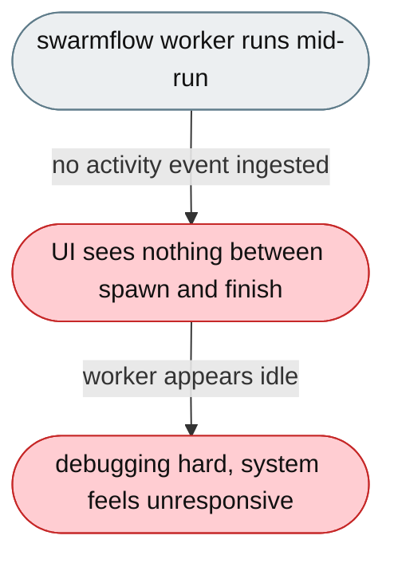
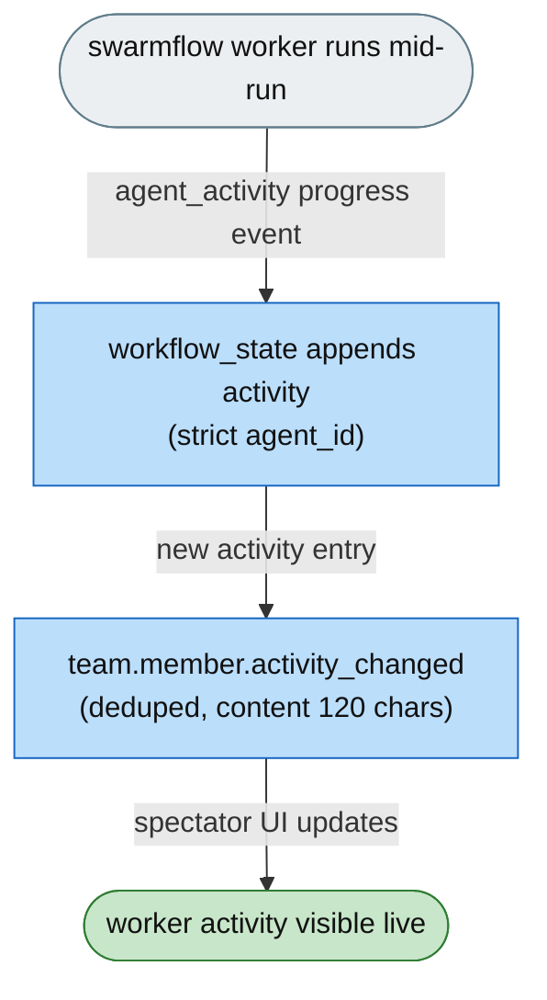

# [Feature]: Surface live swarmflow worker activity to spectators in real time

## Executive Summary

Swarmflow workers perform many actions mid-run (reading files, running tools), but none were visible to spectators — the UI only updated on spawn, finish, and final result, so workers looked idle throughout execution. This feature ingests the `agent_activity` progress events emitted by the agent-core worker backend and translates each new activity entry into a `team.member.activity_changed` event, giving spectators a live, per-worker view of what each worker is doing.

Issue #3581 https://github.com/openJiuwen-ai/jiuwenswarm/issues/3581<br>
PR #2578 https://github.com/openJiuwen-ai/jiuwenswarm/pull/2578

## Background Description

Although `WorkflowAgentActivity` existed as a type, it was documented as "always empty; upstream data not available yet" — no component produced activity events, the workflow backend did not ingest activity, the adapter did not translate it, and the gateway did not forward it. There was no path from worker → workflow state → team events → web UI, so everything between worker spawn and worker finish was opaque.

This part **depends on the agent-core part** ([PR #748](https://github.com/openJiuwen-ai/agent-core/pull/748)), which made the worker backend emit `agent_activity` progress events (via `SwarmflowActivityRail`). The jiuwenswarm PR should be approved **after** the agent-core part is approved.



## Design Ideas

### Proposed design

- **Workflow state ingestion (`workflow_state.py`)** — registers `agent_activity` → `_on_agent_activity` in the progress dispatch map. The handler resolves the worker node by **exact `agent_id`** (strict by id: `_resolve_agent` falls back to label-matching for legacy events, but an activity event always carries the exact node id, so a mismatched id must not append to the wrong same-label node). Non-empty `text` is appended as `WorkflowAgentActivity(timestamp, type="tool_call", content)`; the returned phase delta carries the updated `activity` list.
- **Team-event translation (`team_helpers.py`)** — `_workflow_updated_to_team_events` emits `team.member.activity_changed` for each newly appended activity entry.
  - **Deduplication** — a `seen_activity` map tracks the last-seen activity length per member; only new entries produce events, replayed deltas produce none.
  - **Spawn enrichment** — on member spawn, the worker's `prompt` (truncated to 80 chars) is included.
  - **Status enrichment** — on status change, the worker's `outcome` (truncated to 80 chars) is included.
  - **Activity events** — each new entry produces one `activity_changed` event with content truncated to 120 chars.



## Involved Public APIs

| API | Kind |
|---|---|
| `WorkflowRunState._on_agent_activity()` | new method (progress handler) |
| `team.member.activity_changed` | new team event type |
| `_workflow_updated_to_team_events(..., seen_activity=...)` | extended (new param + activity emission) |

**Impact:** additive. No existing event type is removed or renamed. The `WorkflowAgentActivity` model (previously always empty) is now populated.

## Description of Relevance to Other Modules

- **`jiuwenswarm/agents/harness/team/handlers/workflow_state.py`** — the `agent_activity` progress handler and `WorkflowAgentActivity` model.
- **`jiuwenswarm/server/runtime/agent_adapter/team_helpers.py`** — translates new activity entries into `team.member.activity_changed` events with dedup/enrichment.
- **agent-core** (`agent_teams/workflow/...`) — the worker backend that emits `agent_activity` progress events (see [PR #748](https://github.com/openJiuwen-ai/agent-core/pull/748)); this PR depends on it.
- **Web/TUI frontend** — consumes `team.member.activity_changed` to render live per-worker activity.

## Test Design and Test Plan

Unit/integration tests:

1. **Ingestion** — an `agent_activity` event appends a `WorkflowAgentActivity(type="tool_call", content=...)` entry and returns the phase delta with the updated `activity` list.
2. **Strict agent_id resolution** — a same-label loop's second instance gets activity on its own node, not the first; a mismatched `agent_id` is a no-op.
3. **Empty content** — a blank `text` is not appended.
4. **Dedup** — activity present at spawn is swallowed (no event on the spawn delta); a new entry in a later delta emits exactly one `activity_changed`; a replayed delta emits none.
5. **Truncation** — spawn `prompt`/`outcome` capped at 80 chars; activity content capped at 120 chars.
6. **Non-workflow event** — events that aren't `workflow.updated` produce nothing.

Performance/reliability:

- **No duplicate events** — dedup by last-seen activity length prevents spam on replayed deltas.

## Additional Information

## Solution

Paired: [GitHub #2578](https://github.com/openJiuwen-ai/jiuwenswarm/pull/2578) ↔ [GitCode !4644](https://gitcode.com/openJiuwen/jiuwenswarm/merge_requests/4644)

**What type of PR is this?**
/kind feature

---

## **What does this PR do / why do we need it**

This PR exposes **live swarmflow worker activity** to spectators by emitting `team.member.activity_changed` events whenever a worker performs a mid-run action (typically a tool call).
Previously, worker activity existed only as an empty placeholder model (`WorkflowAgentActivity`) and was never surfaced to the UI. As a result, spectators saw workers as "idle" throughout the run, even when they were actively executing tools.

With this change, every meaningful worker action becomes visible in real time, with strict per-node attribution and deduplication to avoid duplicate events.

Issue #3581

---

## **Problem**

Swarmflow workers perform many actions mid-run — reading files, running tools, executing commands — but none of these were visible to spectators.
The UI only updated when:

- a worker spawned
- a worker finished
- a worker produced a final result

Everything in between was opaque.
This made the system feel unresponsive and made debugging or understanding worker behavior difficult.

Although `WorkflowAgentActivity` existed as a type, it was documented as:

> "always empty; upstream data not available yet"

No component produced activity events.
The workflow backend did not ingest activity, the adapter did not translate it, and the gateway did not forward it.
There was no path from worker → workflow state → team events → web UI.

---

## **Solution**

Worker activity is now streamed live:

- When a worker performs a tool call, spectators immediately see an `activity_changed` event.
- The event includes a concise description of the action.
- Activity is strictly attributed to the correct worker instance.
- Deduplication ensures no repeated events for the same activity entry.

Spectators now see the worker's **prompt** on spawn, **activity** during execution, and **outcome** on finish — giving a complete picture of the worker's behavior.


The feature is implemented across the swarmflow pipeline:

---

## **1. Workflow state: ingest live activity**

The workflow engine now dispatches a new progress event type:

```
event_type = "agent_activity"
```

A handler resolves the correct worker node by **exact agent_id** (strict-by-id resolution prevents cross-instance contamination when multiple nodes share a label).
Non-empty activity text is appended as:

```
WorkflowAgentActivity(timestamp, type="tool_call", content)
```

The phase delta returned includes the updated activity list, allowing the frontend to see new entries immediately.

---

## **2. Team helpers: translate activity into team events**

`team.member.activity_changed` is emitted for each newly appended activity entry.

Key behaviors:

- **Deduplication:**
  A `seen_activity` map tracks the last-seen length per member.
  Only new entries produce events; replayed deltas produce none.

- **Spawn enrichment:**
  On member spawn, the worker's **prompt** (truncated to 80 chars) is included.

- **Status enrichment:**
  On status change, the worker's **outcome** (truncated to 80 chars) is included.

- **Activity events:**
  Each new activity entry produces one `activity_changed` event with content truncated to 120 chars.

This ensures spectators see exactly the new actions, no more and no less.

---

## **3. Tests**

Extensive tests validate:

- correct ingestion and delta propagation
- strict agent_id resolution
- deduplication across repeated deltas
- correct event emission semantics
- correct swallowing of initial activity at spawn

All tests pass.

---

## **Expected Impact**

- Spectators now see **live worker activity** during swarmflow runs
- Activity is strictly attributed to the correct worker instance
- Deduplication prevents duplicate events
- Workers now appear active and responsive throughout execution
- The UI gains a clear, real-time view of what each worker is doing

---

## **Self-checklist**

- [x] **Design**: Reviewed with maintainers
- [x] **Test**: Full test suite added and passing
- [x] **Verification**: Confirmed correct behavior across multi-node workflows
- [ ] **Interface**: No external API changes
- [x] **Document**: Updated docstrings and event semantics
