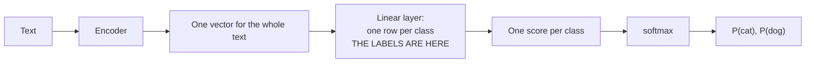
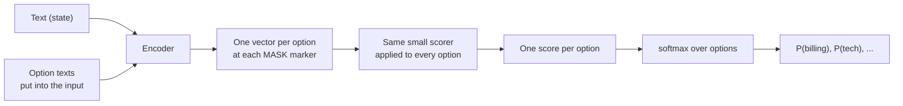
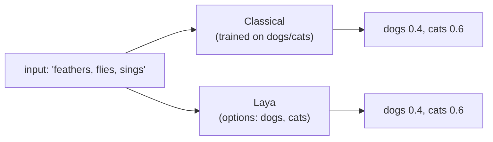
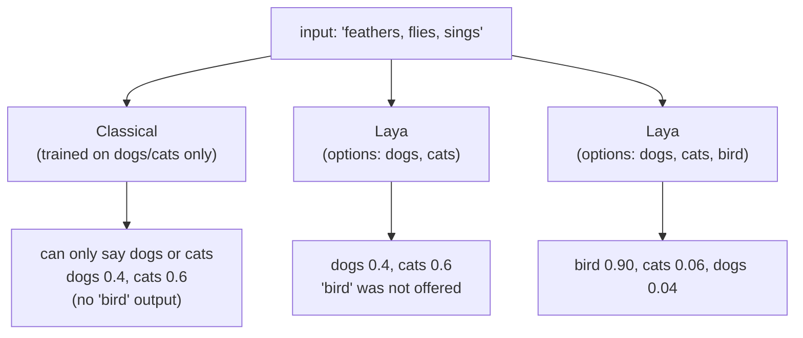
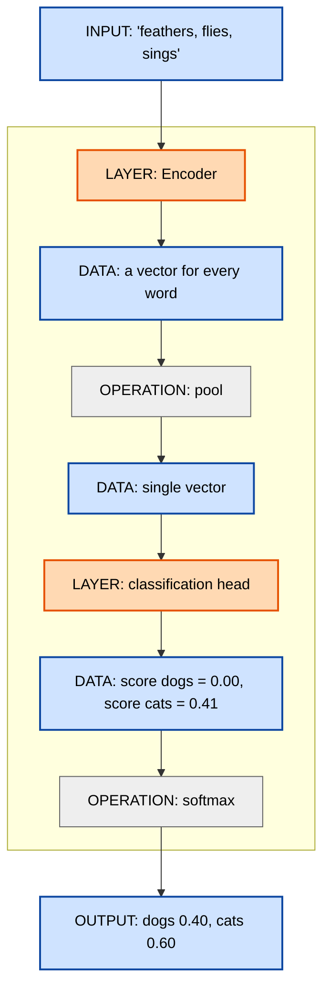
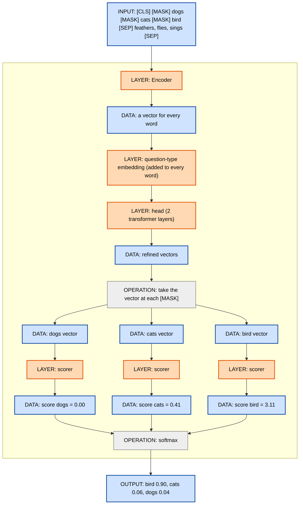
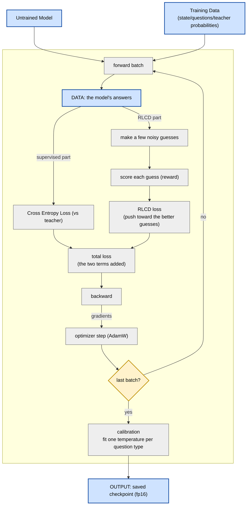

# Laya — Study Notes

> Source: `C:\Workspace\openjiuwenothers\laya` (repo `github.com/NandaKishorM/laya`, package `laya`, v0.3.24, Apache-2.0, author Nandakishor M / **Convai Innovations**).
> A fast, **on-device, non-autoregressive "System 1" decision engine**: text/state + typed questions in, calibrated probabilities out, in one forward pass (~33 ms GPU). Trained with **RLCD** (RL against strictly proper scoring rules).
> No hosted-service dependency by design (see `AGENTS.md`): must run in the user's own process/hardware.

---

## 1. Where the "brain" is

Three layers of "brain", in decreasing order of intelligence:

1. **The models** = the encoders + Laya's decision heads. **This is where the actual deciding happens.** Three checkpoints:
   - `laya` — ModernBERT-large, 421M, English, 512 ctx
   - `laya-multilingual` — mmBERT-base, 322M, 100+ languages, 1024 (→8192) ctx
   - `laya-typed-decisions` — ModernBERT-large, 421M, typed-decision workflows
   Weights live on **Hugging Face** (`convaiinnovations/laya*`), **not in the repo**.
2. **The Router** = a **dispatcher**, not intelligence. A hand-written script + function-word **heuristic** (<1 ms, deliberately dependency-free) that picks which checkpoint runs. Overridable with your own LID model via `lang_guess`.
3. **Calibration** (`calibrate.py`, `confidence.py`) = post-hoc **statistics** (temperature scaling, histogram binning, per-option-count abstention thresholds). Adjusts the model's numbers; does not add understanding.

Everything else (presets, email cleaning, hooks, batching, servers, SDKs) is plumbing.

**Model weights are NOT in the repo.** They are downloaded per checkpoint as:
`model.safetensors` + `rl_agent_config.json` + `tokenizer/` + `encoder/`.

---

## 2. Architecture — `DecisionModel` (`laya/common.py:472`)

`class DecisionModel(nn.Module)` = *"Bidirectional transformer encoder backbone + typed decision head."*

Components:

| Attribute | What | Notes / line |
|---|---|---|
| `self.encoder` | HuggingFace **ModernBERT / mmBERT** | the bulk of params; built in `build_model`, `common.py:578-601` |
| `self.head` | 2 × `nn.TransformerEncoderLayer(d, nhead, 4d)` | `common.py:493` |
| `self.type_emb` | `nn.Embedding(3, d)` — question-type embedding | `common.py:494` |
| `self.scorer` | `LayerNorm(d) → Linear(d,d) → GELU → Linear(d,1)` | `common.py:495` — scores each option |
| `self.act_head` | `Linear(d+4,256) → GELU → Linear(256, n_act)` | `common.py:496` — learned "action" output |
| `self.temperature` | `register_buffer` of 3 values | `common.py:497` — calibration |

`forward` (`common.py:507`):
1. `h = encoder(input_ids, attention_mask).last_hidden_state`
2. `h = h + type_emb(qtype)[:, None, :]` — inject question type
3. run head layers (`src_key_padding_mask`)
4. gather `h` at **`marker_pos`** → one vector per option
5. `logits = scorer(m).squeeze(-1)` → one logit per option
6. `p = softmax(logits)` = **distribution over the options**; padded slots masked to `-1e4`
7. entropy `ent`, `top1`, `top2`, `k/255` → `act_head` → `act_logits`

### Encoder-vs-head split
- **Encoder = the language/world knowledge** (hundreds of millions of params; ModernBERT-large ≈ 421M).
- **Head = Laya's decision ability** (a small fraction: 2 transformer layers + scorer + act_head).
- Both are stored together in the checkpoint's `model.safetensors`.
- `rl_agent_config.json` holds `encoder`, `head_layers`, and `act_costs` (`n_act = len(act_costs)+1`).

### Training — what is actually trained
From `research/scripts/finetune_single_device.py`:
- **Both the encoder and the head are trained**, end-to-end, with **discriminative learning rates** (`:235-238`):
  ```python
  enc_params  = [p for n, p in model.named_parameters() if "encoder."  in n]
  head_params = [p for n, p in model.named_parameters() if "encoder." not in n]
  optimizer = AdamW([{"params": enc_params,  "lr": 2.5e-5},   # fine-tune backbone gently
                     {"params": head_params, "lr": 1.0e-4}])   # train new head faster
  ```
- **Encoder is NOT trained from scratch** — it starts pretrained (`AutoModel.from_pretrained(cfg["encoder"])`, `common.py:600`), as ModernBERT / mmBERT; the script then **fine-tunes** it.
- **Head is trained from scratch** — `type_emb`, the 2 transformer layers, `scorer`, `act_head` do not exist in ModernBERT.
- **Loss** = `proper_reward(...)` (`:278`) = **strictly proper scoring rule** (log + spherical + ranked probability score) → **RLCD**.
- **Temperature** is *not* trained with the model — it is fit afterward (`calibrate.py`, LBFGS on `log_t`, `:144-151`); histogram binning and abstention thresholds are also post-hoc.
- `detach_encoder=True` (`common.py:509`) allows **freezing the encoder** and training the head only, but the shipped recipe trains both.

---

## 3. How options map to output slots — the marker mechanism

The model **never generates text**. It **scores one `[MASK]` "marker" per option**.

1. **Question types** (`common.py:18`): `QTYPES = {"choice": 0, "score": 1, "noul": 2}`.
2. **Render options** (`render_options`, `common.py:107`):
   - `choice` → one text per criterion entry; no description → just the label (`"billing"`), else `"billing: invoices, refunds"`.
   - `score` → one text per level, in order (`"level 0: calm"`).
   - `noul` → **always two**, semantic order `[false, true]`; defaults `"false"/"true"`, custom via `labels`.
3. **Build the head** (`build_head`, `common.py:196`):
   ```
   [CLS] <type> question: <instructions> [SEP] [MASK] opt0 [MASK] opt1 ... [SEP]
   ```
   Each option is prefixed with `[MASK]`; the `[MASK]`'s **absolute position** is appended to `markers`.
   **1 marker = 1 option = 1 output slot.**
   Options share `head_max_len` (192 on `laya`, 256 on the others); overflow trims each option (reported as `tokens_per_option`).
4. **Build the sequence** (`build_sequence`, `common.py:136`):
   ```
   [CLS] <type> instructions [SEP] [MASK] opt0 [MASK] opt1 … [SEP] <state> [SEP]
   ```
   State appended after the head; clamped to the room the head leaves (`state_room`).
5. **Forward (see §2)** → one logit per marker → softmax = per-option distribution.

### Per-type slot mapping
| Type | Slots (markers) | Output |
|---|---|---|
| `choice` | one per criterion entry (`k`) | `softmax[k]`; `choice = keys[argmax]`; `probabilities` keyed by label |
| `score` | one per level (`L`) | `softmax[L]`; `score = Σ i·pᵢ` (expected level); `legend` maps index→level text |
| `noul` | exactly 2 (`false`, `true`) | `softmax[2]`; `noul = p[1]` = P(true) |

### Decoding & calibration (`_decode_answers`, `agent.py:1188`)
- `k = len(markers)`.
- Temperature scale by `temp_bucket(qt, k)` (and optional per-language override).
- `unpermute_probs` restores the caller's option order when `option_order` reordered.
- `confidence`: for `noul` = `max(p)`; for `choice`/`score` = normalized entropy. Also `answer_confidence` = probability of the reported answer (the **calibrated** one to gate on), plus `action` = `act_probability`.

---

## 4. Classical classifier vs Laya

Both answer the same question: "which option fits this text?" The difference is **where the options live**.

### Classical classifier: the options are the model's weights

- The labels are **weight rows** in the last layer.
- The number of labels is **fixed at training time**. Add "bird" → add a row and retrain.

### Laya: the options are part of the input text

- The labels are **tokens in the input**, not weights.
- The scorer is the **same** for every option (output size 1), so the number of labels is **not baked in**. Add "bird" → just type it in the request.

### Side by side
| Question | Classical classifier | Laya |
|---|---|---|
| Where do the labels live? | the last layer's weights | the input text |
| How many labels? | fixed at training | whatever you send |
| Add a new label | retrain | just write it |
| Answer unseen labels? | no | yes (zero-shot) |
| Do labels cost anything at run time? | no | yes, they take input space |

### Real-life example

The input is **always** `"feathers, flies, sings"`. The only thing that changes is which options you allow.

**Options = dogs, cats** — the classical model and Laya agree:


**Options = dogs, cats, bird** — only Laya can say "bird":


| input | options you send | Classical (dogs/cats) | Laya |
|---|---|---|---|
| feathers, flies, sings | dogs, cats | cats | cats |
| feathers, flies, sings | dogs, cats, bird | impossible (no "bird" row) | bird ✅ |

**The point:** the classical model can never say "bird" — it has no weight row for it. Laya can, the moment you add "bird" to the options, because the option is just text in the input.

### The data flow (technical)
Input is always `"feathers, flies, sings"`; only the options change.

**Three kinds of boxes (the same in both diagrams):**
> 🟧 **LAYER** = has trainable weights (it learns) · ⬜ **OPERATION** = fixed math, no weights · 🟦 **DATA** = the values that flow through
> "Layer" here always means **has weights**. That is why `pool` and `softmax` are **operations, not layers** — they have no weights.

**1. Classical classifier, trained on dogs and cats only**


**2. Laya, options = dogs, cats, bird**


With only `dogs, cats` (no bird), Laya gives the same as diagram 1 (`dogs 0.40, cats 0.60`).

`*` **scorer** = `LayerNorm → Linear → GELU → Linear(1)`.

**Box types**
- 🟧 **LAYER** (has trainable weights): **Encoder**, **question-type embedding**, **head**, **scorer**, **classification head**.
- ⬜ **OPERATION** (fixed math, no weights): **pool**, **softmax**, **take the vector at each [MASK]**.
- 🟦 **DATA**: the values that flow — vectors, scores. **INPUT** = what you send; **OUTPUT** = the final probabilities.

Notes:
- **classification head** = the last layer that has weights (a plain Linear); after it comes only softmax (no weights). It is also called the **classifier** or **output layer**. The encoder contains linear layers *inside* it too — this is just the extra one on top. In Laya the same role is played by the **scorer**.
- A **LAYER** can produce or consume **many data values**: one Encoder gives **every word its own vector**; one scorer gives **one score per option**.

To add "bird", you add **one more `[MASK] bird` span** → one more option vector → one more score. The classical model has nowhere to put it: its final layer has exactly 2 weight rows (dogs, cats) and cannot grow without retraining.

### The key difference
Both return probabilities over options. But a classical classifier **learns one weight row per option**, so it only answers options it trained on. Laya **reads the option text with the encoder and scores each option with one shared scorer**, so it can answer options it never saw. That is the whole "zero-shot" trick.

---

## 5. There is no "autoregressive" step
- Single forward pass over `[question head | state]`; one logit per option; no token-by-token generation → nothing to parse, nothing to hallucinate.
- Batch: `predict_batch` / `Router.predict_batch` share forward passes; `sort_by_length` reduces padding (measured ~1.4x).

---

## 6. Training / fine-tuning (in the repo, not the pip package)

Laya ships already-trained models. In this repo you can also **fine-tune** them on your own decisions. The main script is `research/scripts/finetune_single_device.py` (plus two notebooks).

### What "fine-tune" means here
- You **keep the pretrained model** and continue training it a little on your labeled examples.
- Your data is a JSONL file; each line is one case:
  `{"state": "...", "questions": {...}, "gold": {...}}`
  where `gold` is the **answer probabilities you want** (a "teacher" answer).
- The recipe adjusts the **encoder** gently (small learning rate `2.5e-5`) and trains the **head/scorer** more strongly (bigger rate `1.0e-4`).

### The loop

Same box types as above: 🟧 **LAYER** (has weights) · ⬜ **OPERATION** (a step or math) · 🟦 **DATA** (values), plus a decision (◇) for the branch.



1. **Supervised part:** reduce the gap between the model's answer distribution and the teacher distribution (cross-entropy).
2. **RLCD part:** take the model's scores, add random noise a few times to make several slightly different answer distributions, score each with a proper scoring rule (which rewards answers that are accurate and honest about their confidence), and push the model toward the better-scoring ones.
3. Add the two into one loss, then **backward** and **optimizer step**.

Laya's training is called **RLCD = Reinforcement Learning for Calibrated Decisions** because it trains the model to give well-calibrated probabilities, not just the right top answer.

### Other training machinery
- **AdamW** optimizer + a **cosine** learning-rate schedule.
- **Mixed precision** (faster, less memory) + **gradient clipping** (stable updates).
- **Gradient checkpointing** (saves memory).
- The **noise size shrinks** over epochs (from `0.4` to `0.1`).

### Calibration and save
- On a **held-out slice**, fit one temperature per question type.
- Save the model in fp16 plus its config.

### Analogy
- **Normal classifier training:** *"Here are the right answers — get closer to them."*
- **Laya (RLCD):** *"Here are the right probability distributions. Try a few noisy guesses, reward the ones that are better calibrated, and get closer to the teacher."* It optimizes accuracy and confidence together.

### Where the code is
- `research/scripts/finetune_single_device.py` — one device (CPU or a single GPU).
- `notebooks/laya_finetune_typed_decisions_2xT4_kaggle.ipynb` — 2×T4.
- `notebooks/laya_finetune_typed_decisions_mps.py` — Apple Silicon.
- **Data:** your own JSONL, or the Hugging Face dataset `LocalLLaMA/typed-decisions` (for the typed-decisions checkpoint).

---

## 7. Key files

| File | Role |
|---|---|
| `laya/common.py` | `DecisionModel` (encoder + heads), `build_head`/`build_sequence` (marker construction), `render_options`, `QTYPES`, `proper_reward` (RLCD) |
| `laya/agent.py` | `Agent` — loads `model.safetensors` (`load_file`), tokenizes, `predict`/`predict_batch`, `_decode_answers` |
| `laya/router.py` | checkpoint routing + checksum pinning (dispatcher; no learned brain) |
| `laya/lang.py` | script/function-word language detection heuristic |
| `laya/calibrate.py` | temperature maps, histogram binning, abstention thresholds |
| `laya/confidence.py` | confidence / entropy math |
| `laya/fast.py` | TileLang GPU fast path (own `forward`) |
| `laya/onnx_agent.py` | ONNX Runtime path (`ONNXAgent`) |
| `laya/serve.py` | Jev-compatible HTTP server (`/v1/systemone`, `/v1/systemone/batch`) |
| `laya/mcp/` | MCP server + tools |
| `laya/shortlist.py` | narrow a large label set before deciding (`predict_shortlist`) |
| `laya/presets.py` | ready-made question sets (triage, email, moderation, guard, router) |

---

## 8. Relation to Jev / OpenJev
- **Jev** (TypeSafe) = proprietary, purpose-built decision model. **Laya** = open model of the same class (trained encoder + head) **plus** a full framework (router, calibration, servers, SDKs).
- **Wire-compatible with Jev**: `laya-serve` exposes `POST /v1/systemone`, so a Jev client works by repointing `baseUrl`. Documented diffs from Jev: option budget is a token budget (~20 options) not Jev's 255; every score level needs a description; `confidence` is `1 − normalized entropy` (Jev uses `(n·p_max − 1)/(n − 1)`).
- **OpenJev** serves Laya under the name `laya-1.0` (the `laya-typed-decisions` checkpoint) behind the same Jev API.

## 9. One-liner
**Architecture:** `laya/common.py::DecisionModel` (ModernBERT/mmBERT encoder + Laya's scorer/act heads). **Brain weights:** Hugging Face `model.safetensors` per checkpoint (not in the repo). **Loader/runtime:** `laya/agent.py::Agent`. **Router:** just picks which of the three brains to load. **Decisions:** one `[MASK]` marker per option → one logit per option → softmax → calibrated probabilities.
