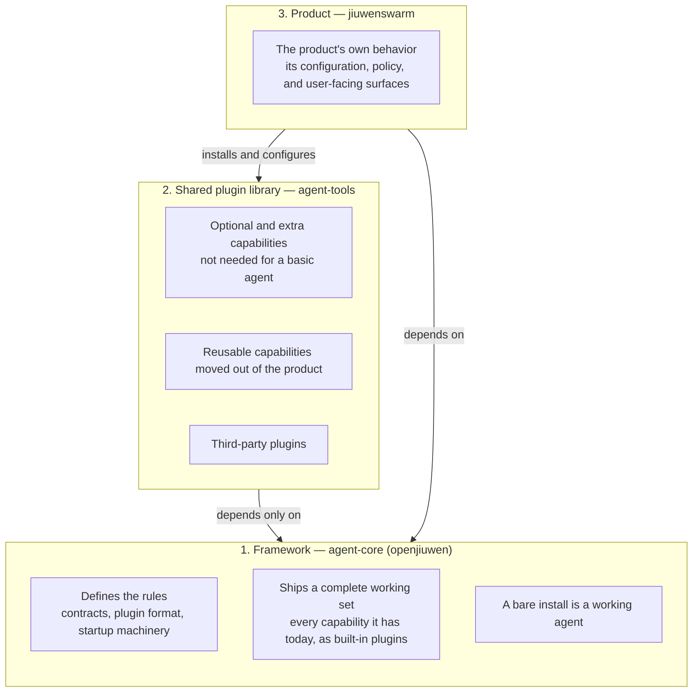
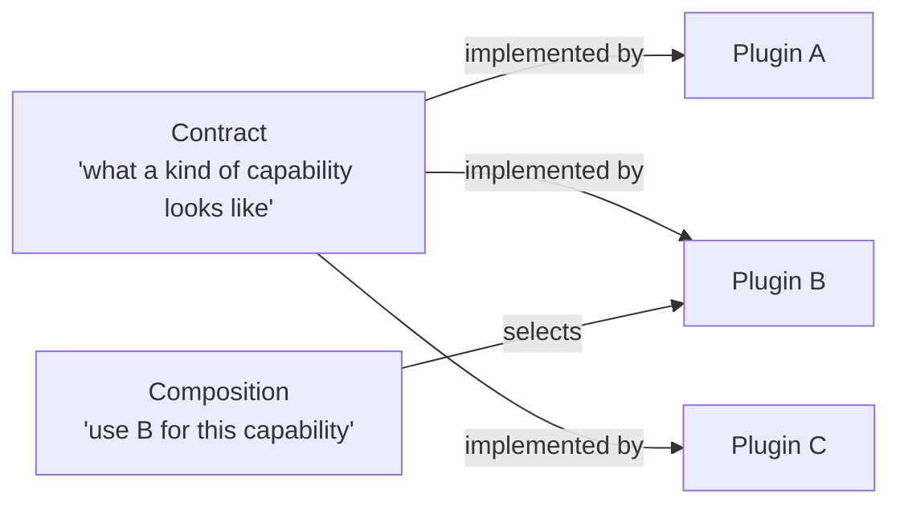
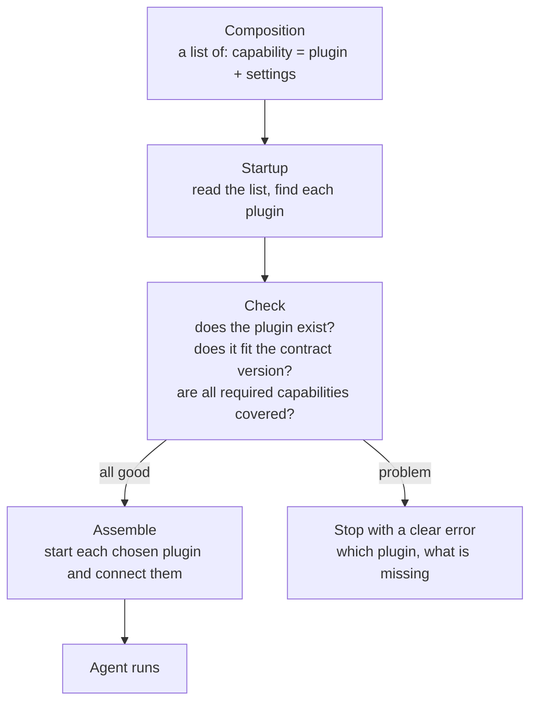
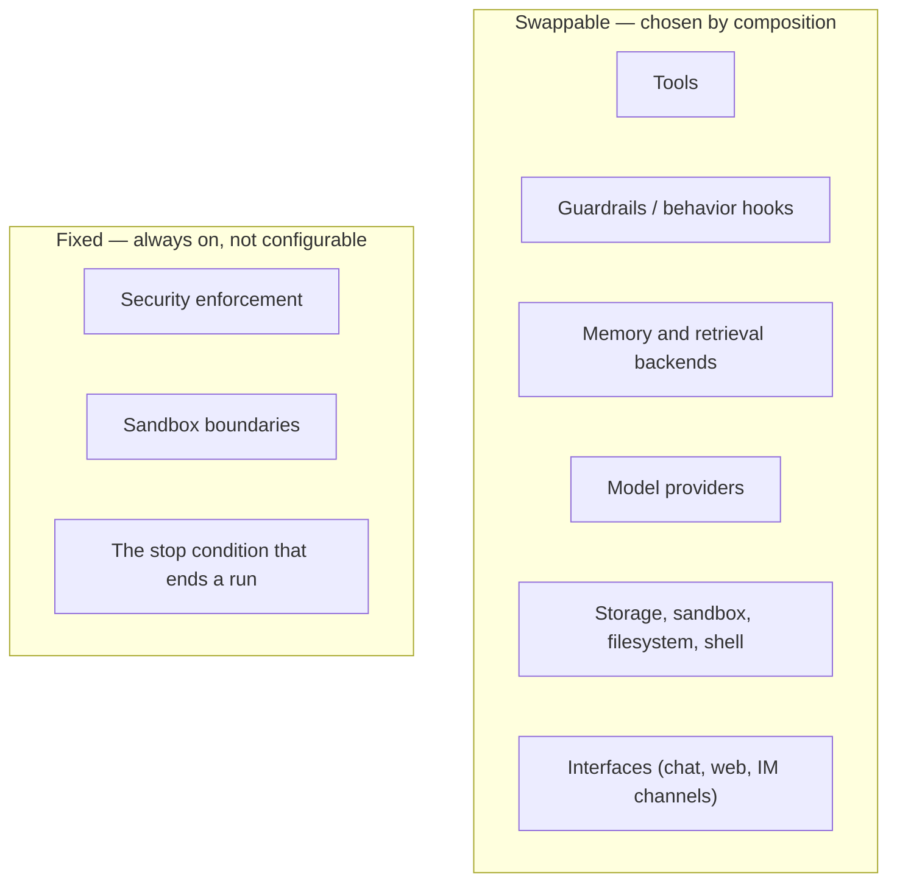
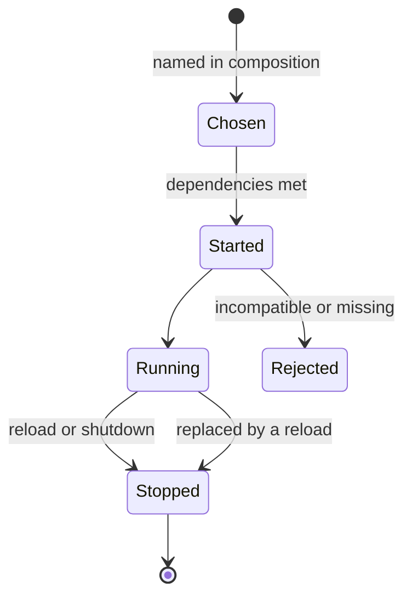
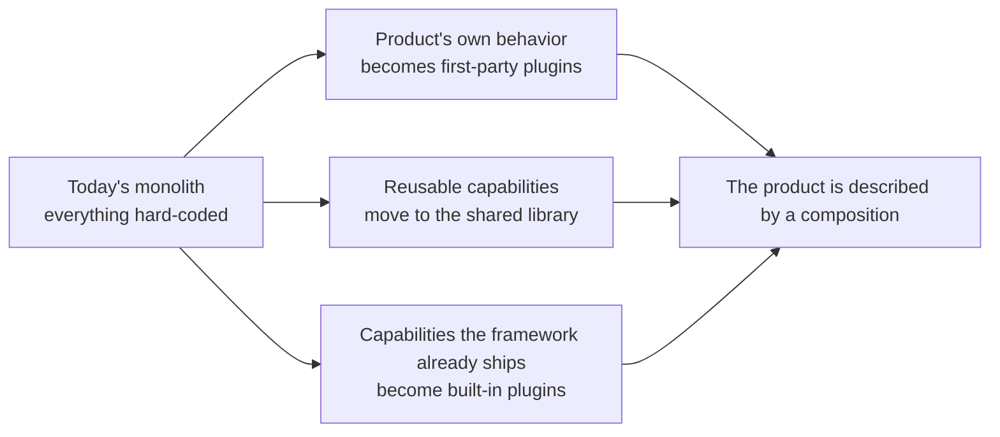

# Plugin system — architecture

A big-picture view of how the plugin system is meant to work, written for architects who are new to the Jiuwen codebase. It explains the shape of the system, not its internals.

Derived from the three plans: `00_agent-core-pluggability-plan.md`, `01_agent-tools-pluggability-plan.md`, `02_jiuwenswarm-pluggability-plan.md`.

---

## The problem being solved

Today the product (`jiuwenswarm`) is one large, hard-coded program: which behaviors an agent has — its tools, its guardrails, its memory, its permissions — is decided by code. Adding or changing a capability means editing and rebuilding the core.

The plugin system replaces that with three ideas:

| Idea | Plain meaning |
|---|---|
| **Contract** | A named, stable interface for a kind of capability (for example "a memory backend" or "a tool"). |
| **Plugin** | A swappable implementation of a contract. |
| **Composition** | A configuration file that says which plugin to use for each contract, and how they are grouped. |

The goal: behavior comes from configuration, not from code. Adding a capability becomes "install a plugin and add one line to a config file."

---

## The three layers

The system is split across three projects, each with one clear job and a one-way dependency direction.

| Layer | Who it is for | What it owns |
|---|---|---|
| **Framework** | anyone building an agent | the contracts, the plugin system, and a built-in set of capabilities |
| **Plugin library** | the product, plus opt-in users | optional capabilities, and capabilities shared between products |
| **Product** | end users | the specific experience: its config, its policy, its interfaces |

The crucial rule is the **arrow direction**: the framework never depends on the product or the library. That keeps the framework stable and keeps products from leaking into the foundation.

---

## The core concepts

Three moving parts explain the whole system.

| Concept | What it is | Who can change it |
|---|---|---|
| Contract | The rules for one kind of capability: what it must do, what events it publishes, which version it is | The framework only |
| Plugin | A concrete implementation of a contract | Anyone — the framework, the library, the product, or a third party |
| Provider choice | Which plugin is used for a contract, and its settings | The composition (a config file) |

A useful analogy: a **contract** is a power socket standard, a **plugin** is an appliance, and the **composition** is which appliance you plug into which socket. The framework owns the socket; anyone can build an appliance.

---

## How an agent is assembled

When the product starts, it does not build an agent in code — it reads a composition and assembles the agent from plugins.

Two properties matter to architects:

| Property | Why it matters |
|---|---|
| **Fail fast and visible** | If a config names a plugin that is missing or incompatible, startup stops and says exactly which one — instead of failing mysteriously later. |
| **No hidden behavior** | An agent has only the behaviors the composition lists. Nothing is added behind the author's back. |

---

## What is fixed, what is swappable

Not everything should be a plugin. The system deliberately draws a line.

| Category | Reason |
|---|---|
| Swappable | These vary by deployment, product, or customer |
| Fixed | These are safety properties — they must not be turned off by configuration |

This is the main security stance of the system: **plugins can add policy, but they cannot disable the safety floor.**

---

## Trust and isolation

Plugins are code written by others and run inside the agent. The architecture treats that plainly.

| Concern | Approach |
|---|---|
| A plugin fails or crashes | Contain the failure so it does not take down the whole agent |
| A plugin misbehaves or is malicious | Give it only the access it declared; enforce permissions rather than trusting it |
| A plugin is incompatible | Refuse it at startup, before it runs |
| A plugin needs heavy or vendor-specific software | Keep those as optional extras, so a basic install stays small |

---

## Lifecycle in one picture

A plugin is not just loaded once; the system manages its whole life.

| Moment | What happens |
|---|---|
| Start | The framework mounts the plugin and connects it to the contract |
| Reload | Change the composition, and only the affected plugins are restarted |
| Stop | Every plugin gets a chance to clean up what it started |
| Reject | A bad plugin is refused with a clear message, not partially started |

---

## Migration: from a monolith to a composition

The product today is a monolith. The plan does not rewrite it in one step; it "strangles" it gradually while behavior stays identical.

| Rule during migration | Reason |
|---|---|
| Behavior must not change | Existing test results must stay identical at every step |
| Old configuration keeps working | A compatibility path keeps existing setups running during the transition |
| One capability at a time | Each move is small, reviewed, and reversible |

---

## Summary for architects

| Question | Answer |
|---|---|
| What is the system? | A way to build agents by configuration instead of code |
| What are the three layers? | Framework (rules + built-ins), shared library (optional plugins), product (config + policy) |
| What does a plugin do? | Implements one contract so it can be swapped |
| Where is behavior decided? | In the composition, not in code |
| What stays fixed? | Security enforcement, sandbox boundaries, the stop condition |
| How does migration work? | Gradually, preserving behavior at every step |
| What is the main risk to manage? | Trust in third-party plugins, and keeping the framework's contract stable |
