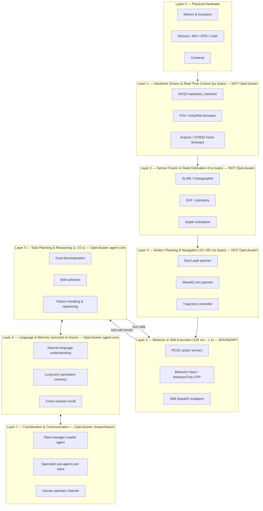
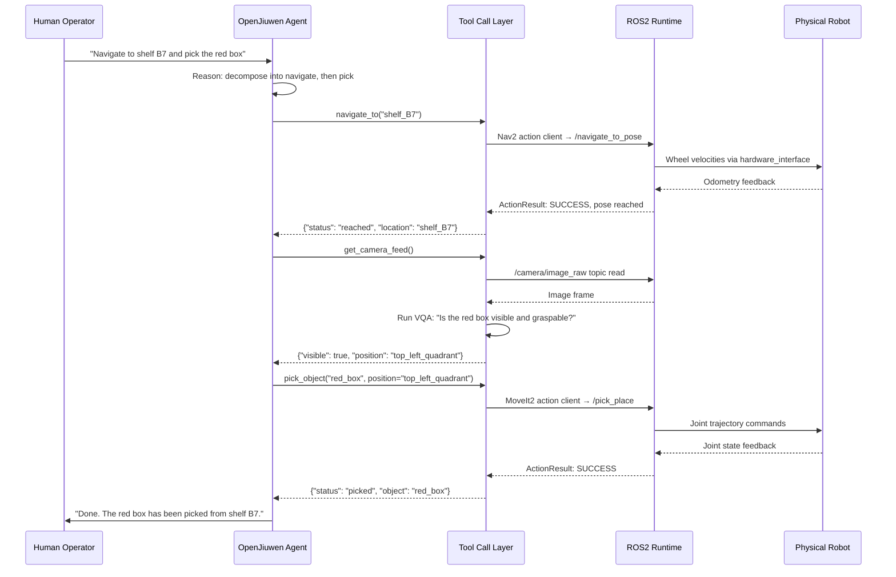
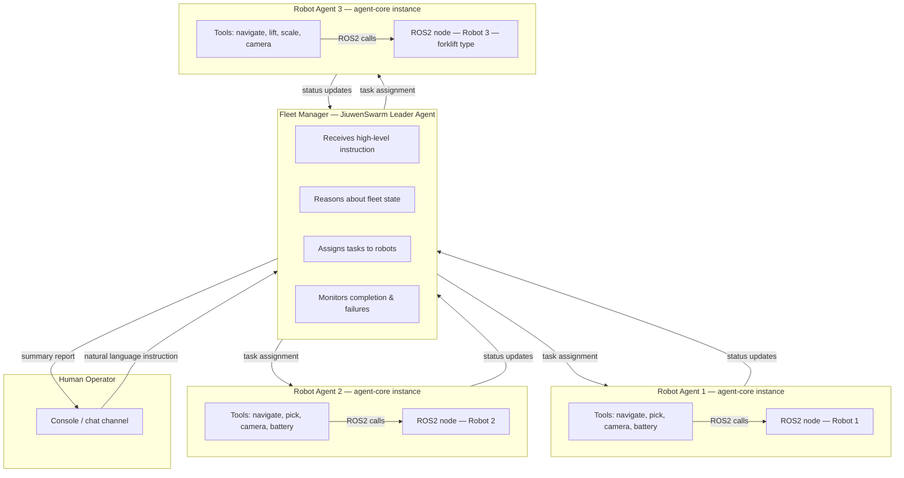

# OpenJiuwen as the Reasoning Brain of a Robot

## 1. What It Is

Every robot stack has the same problem. At the bottom are motors, sensors, and firmware that operate in microsecond loops. Above that, middleware like ROS2 handles sensor fusion, localization, and motion planning across millisecond timescales. These layers are mature and well-understood. What has always been missing is a competent layer at the top — one that understands language, remembers what happened last Tuesday, plans across a sequence of subtasks, and coordinates with other robots when the situation demands it.

OpenJiuwen occupies that top portion of the stack. Specifically: agent-core provides the single-agent runtime — the LLM reasoning loop, tool dispatch, memory management, workflow execution, and session continuity. JiuwenSwarm builds on top of that to provide multi-agent coordination — a Leader agent that decomposes goals, assembles specialist teams, assigns tasks, monitors status, and recovers from failures. Together they form the reasoning brain. Everything below — PID controllers, joint trajectories, SLAM maps, sensor drivers — stays in ROS2, PX4, or whatever real-time middleware is already running on the robot.

The key insight is that robots have always been good at moving and sensing. What they have been bad at is understanding a vague natural language instruction, maintaining a coherent memory across power cycles, planning a ten-step goal when step 4 fails, and telling three other robots what to do while they do it. OpenJiuwen fills exactly that gap and nothing else.

---

## 2. The Robot Stack — Where OpenJiuwen Fits

The diagram below shows a complete robot architecture. The dividing line is clear: OpenJiuwen lives in layers 5 through 7. It commands layer 4 through tool calls. It never touches layers 0 through 3.



The boundary at layer 4 is important. OpenJiuwen does not call a motor controller. It calls a ROS2 action server — a named, documented interface that either succeeds or fails with a structured result. The action server internally does whatever real-time work is needed. OpenJiuwen never sees any of that.

---

## 3. How OpenJiuwen Connects to the Robot

The integration mechanism is straightforward: every robot capability that OpenJiuwen needs to invoke is wrapped as a `@tool` function. The function signature is what the LLM sees and reasons about. The function body makes the actual ROS2 call — an action client, a service call, or a topic read. OpenJiuwen's agent reasoning loop calls these tools the same way it would call a web search or a database query.



The tool wrappers in agent-core are registered using the standard `@tool` decorator pattern. A minimal set of wrappers for a mobile manipulation robot looks like this:

```python
# Illustrative pseudocode — not runnable as-is.
# Real implementation requires a running ROS2 node and rclpy.

from openjiuwen.core.single_agent.legacy import WorkflowAgent
from openjiuwen import tool

@tool
async def navigate_to(location: str) -> dict:
    """Navigate robot to named location. Returns success/failure and final pose."""
    result = await ros2_nav2_client.send_goal(location)
    return {"status": result.status, "pose": result.final_pose}

@tool
async def pick_object(object_name: str) -> dict:
    """Pick a named object using MoveIt2. Returns success/failure."""
    result = await ros2_moveit2_client.pick(object_name)
    return {"status": result.status}

@tool
async def get_camera_feed() -> dict:
    """Capture current camera frame and run VQA. Returns scene description."""
    frame = ros2_camera_topic.latest()
    description = await vqa_model.query(frame, "Describe all visible objects.")
    return {"scene": description}

@tool
async def report_battery() -> dict:
    """Read battery level from ROS2 sensor topic."""
    level = ros2_battery_topic.latest()
    return {"battery_percent": level}

@tool
async def send_alert(message: str, channel: str = "operator_console") -> dict:
    """Send a message to the human operator channel."""
    await messaging_client.send(channel, message)
    return {"sent": True}

agent = WorkflowAgent.create(
    name="warehouse_robot_1",
    tools=[navigate_to, pick_object, get_camera_feed, report_battery, send_alert],
    memory_enabled=True,
)
```

OpenJiuwen's reasoning loop decides when to call each tool and in what order. It handles the case where a tool returns failure — replanning, retrying with different parameters, or escalating to the human operator. None of that logic is in the tool itself; the tool just does one thing and reports the result.

---

## 4. Multi-Robot Coordination

JiuwenSwarm's multi-agent team architecture maps directly onto a robot fleet. Each physical robot runs its own OpenJiuwen agent instance. A fleet manager agent — the Leader — holds no tools for physical robot actions. Instead its tools are `assign_task(robot_id, task)`, `query_robot_status(robot_id)`, and `broadcast_message(robots, message)`. It reasons at the fleet level: which robot should handle which job, what the priority ordering is, and what to do when a robot goes offline.



The Leader agent in JiuwenSwarm is spawned as a team coordinator. Sub-agents for each robot are spawned dynamically or statically depending on fleet size. When a robot agent reports that it cannot complete a task (obstacle, low battery, arm fault), the Leader reassigns the task to another robot or breaks it into sub-pieces that multiple robots can handle together. This failure recovery is handled through the same LLM reasoning loop — there is no hardcoded fallback tree.

The Leader also manages task priority. If a new high-priority instruction arrives while robots are busy with lower-priority jobs, the Leader evaluates which in-progress tasks can be safely paused and which must complete before interruption. This is a decision that requires contextual understanding — exactly what the reasoning layer provides.

---

## 5. Memory and Learning Across Missions

By default, robots have no memory. When a robot reboots, it starts fresh. It does not remember that the elevator on the east wing was out of service last week, that dock 3 has a broken floor sensor that gives false readings, or that a particular user prefers packages left at the side entrance.

OpenJiuwen's long-term memory (`openjiuwen.core.memory.long_term_memory`) changes this. Memory is written to persistent storage after each session and is retrieved by semantic similarity at the start of subsequent sessions. The robot's agent does not manually manage what to remember — the framework extracts and stores salient facts automatically from the session conversation and tool results.

Memory in the robotics context takes several concrete forms:

**Environment facts**: "The doorway to lab 4B is 82 cm wide — the wide cart cannot pass." This is written once, retrieved every time the robot is asked to enter lab 4B.

**User preferences**: "User Alice always wants deliveries to her secondary office on floor 3, not her listed address on floor 5." Written after the first correction, retrieved on all subsequent deliveries for Alice.

**Equipment state**: "The dock 3 floor sensor has been unreliable since 2025-06-14 — ignore its readings and rely on camera confirmation instead." Written after a maintenance note, retrieved whenever the robot works near dock 3.

**Mission history**: "The north field's wet patch near the east fence boundary was at GPS coordinate 38.91°N 77.04°W during the last three spring seasons." Retrieved when planning spray routes for the current season.

Memory persists across sessions, power cycles, and hardware replacement — because it is stored externally, not on the robot. If a robot is retired and replaced with a new unit, the new unit inherits the full memory of its predecessor by being registered with the same agent identity.

---

## 6. Real-World Examples

### 6.1 Warehouse Fulfillment Robot Fleet

**Scenario**: A FedEx-style distribution center runs 12 AMR robots managed by a JiuwenSwarm fleet. A shift supervisor sends a message to the operations console: "Large shipment arriving at dock 3 in 20 minutes. Clear the east corridor and have 4 robots ready to unload."

**Flow**:

The fleet manager Leader agent receives the message and parses it into two concurrent goals: (1) clear the east corridor, (2) position 4 robots at dock 3 by T-20 minutes.

The Leader queries each robot agent's status. It finds: 3 robots are idle in the charging bay, 6 are mid-task (inventory counting, shelf restocking), 3 are on charging cycles. The Leader evaluates which in-progress tasks can be paused — inventory counting can be interrupted without data loss; restocking a half-loaded shelf cannot. It marks 4 robots as dock-3-assigned (3 from idle bay + 1 from the inventory count, which it safely pauses) and assigns the corridor-clearing task to a 5th robot that is nearest to the east corridor.

Each robot agent receives its assignment. The corridor-clearing robot calls `navigate_to("east_corridor_entrance")`, then calls `get_camera_feed()` in a loop to identify obstacles, calling `move_obstacle(object_id)` for each one. The 4 dock robots navigate to dock 3 staging positions and call `report_ready()`. The Leader collects the ready confirmations and reports back to the supervisor: "East corridor cleared. Robots 2, 5, 7, and 9 are staged at dock 3. Robot 11 cleared 3 pallets from the corridor. All ready with 6 minutes to spare."

**Without OpenJiuwen**: The supervisor would have to manually identify which robots to reassign, message each one individually through a separate interface, and track completion by watching a dashboard. The corridor clearing would require a separate manual job ticket.

---

### 6.2 Hospital Medication Delivery Robot

**Scenario**: A nurse at a hospital station tells the delivery robot: "Deliver insulin to room 312, it's urgent, and the patient has a penicillin allergy — make sure you don't mix up the trays."

**Flow**:

The robot's agent calls `query_ehr(room="312")` (a tool wrapping the hospital EHR API) and receives: patient ID, current medications, allergies (penicillin, amoxicillin), and room location. It calls `verify_medication_label(tray_id="current_loaded_tray", expected_medication="insulin")` — a tool that reads the RFID tag on the loaded tray and confirms it contains insulin, not a penicillin-derivative. The label check passes.

The agent plans the route. Its memory contains: "Elevator B (east wing) averages 4 minutes wait during shift change hours (07:00–09:00, 15:00–17:00). It is currently 16:20." The agent routes via elevator A instead, shaving 3 minutes off the expected delivery time.

Navigation is handled by ROS2 Nav2. When the robot enters the corridor outside room 310, its lidar detects an unexpected obstacle — a crash cart left in the hallway. Nav2 attempts a replan and finds no viable path. It returns a BLOCKED status to the tool call. The agent receives `{"status": "blocked", "reason": "corridor_obstacle", "location": "hallway_310_312"}`. It calls `send_alert(message="Obstacle blocking corridor outside room 310–312. Delivery paused. Can someone clear the corridor?", channel="nursing_station_3")`. A nurse clears the cart within 90 seconds. The agent retries navigation and completes the delivery. The agent writes to memory: "Corridor outside room 310 occasionally obstructed during afternoon shift — check before routing."

**Without OpenJiuwen**: A standard navigation robot would either fail silently, reroute without notifying staff, or require a manual restart. It would have no mechanism to cross-check the medication against the allergy record or to remember the elevator preference.

---

### 6.3 Construction Site Inspection Drone

**Scenario**: A project manager sends a voice message (transcribed to text): "Check the concrete pours on floors 3 and 4, I need to know if they're ready for the next layer — report on my desk in 2 hours."

**Flow**:

The drone's agent retrieves from its knowledge base the concrete inspection criteria it ingested at project start: ACI 301 curing standards, minimum surface hardness indicators visible in photos, surface defect classifications. The project manager's instruction implicitly references these criteria — the agent does not need to ask for clarification.

The agent constructs a flight plan: GPS waypoints covering all pour zones on floors 3 and 4, with hover points above each pour area for photo capture. It calls `upload_waypoint_mission(waypoints=[...])` — a tool wrapping the PX4 MAVLink mission upload. PX4 handles all flight control: attitude, altitude hold, GPS following. The agent calls `execute_mission()` and waits.

At each hover point, the agent calls `capture_photo(camera="downward_nadir")`. It then calls `run_vqa(image=photo, query="Evaluate this concrete pour surface against ACI 301 curing indicators. Is the surface ready for the next layer? List any visible defects.")` for each image. The VQA tool runs a multimodal model against the image and returns a structured assessment per pour zone.

The agent compiles the results into a structured report: pour locations, assessment status (ready / not ready / inconclusive), specific defects noted, and recommended actions. It calls `send_report(recipient="project_manager@site.com", format="pdf", content=report)`. Total elapsed time: 47 minutes for the flight, 12 minutes for VQA processing, 3 minutes for report generation. The report arrives well within the 2-hour window.

**Without OpenJiuwen**: The drone can fly a pre-programmed route autonomously. But someone still has to review every photo manually, apply the inspection criteria, and write the report. The reasoning and document-generation work is entirely eliminated by the reasoning layer.

---

### 6.4 Home Assistant Robot

**Scenario**: A user says casually at 5:00 PM while walking out the door: "The kitchen is a mess, can you deal with it before my guests arrive at 7?"

**Flow**:

The agent calls `get_current_time()` — 17:03. Guests arrive at 19:00. The agent has 116 minutes. It calls `get_room_map(room="kitchen")` to retrieve the current object layout from the home's semantic map. It calls `get_camera_feed(room="kitchen")` and runs a VQA pass to inventory visible mess items: dirty dishes in sink, crumbs on counter, full trash bin, a bag on the counter of unknown ownership.

The agent decomposes "deal with it" into a concrete task list with time estimates: load dishwasher (20 min), wipe counters (10 min), take out trash (8 min), sweep floor (12 min). It schedules them with buffer, starting immediately.

During execution, the agent encounters the bag on the counter. Its VQA call returns: "Canvas tote bag, unbranded, contents unknown." The agent cannot determine if this belongs to the user or is trash. Rather than guessing, it calls `send_message(channel="user_phone", message="There's a canvas bag on the kitchen counter. Should I move it somewhere or leave it? I'll continue with everything else while you decide.")` The user replies: "Leave it, that's my gym bag." The agent notes this in memory ("user's gym bag is kept on kitchen counter — do not move") and continues with the remaining tasks.

At 18:41, all tasks are complete. The agent calls `send_message(channel="user_phone", message="Kitchen is clean. Dishes are running, counters wiped, trash taken out, floor swept. Gym bag left on counter as requested.")`.

**Without OpenJiuwen**: A conventional home robot can execute specific commanded routines. It cannot interpret "deal with it," decompose the goal, handle the ambiguous item, or send an asynchronous question to the user and resume work after the answer.

---

### 6.5 Agricultural Autonomous Tractor

**Scenario**: A farmer sends a message via a mobile app at 07:30: "Do the north field today — it needs spraying for aphids but skip the wet patch near the east fence, the ground's too soft."

**Flow**:

The agent retrieves from its memory the definition of "north field": field ID NF-04, boundary polygon, last treated 14 days ago. It also retrieves a memory entry written in March: "Wet patch near east fence boundary: approximate GPS polygon [coordinates], problematic in spring after rain — confirmed soft ground on 2025-03-18 and 2025-04-02." The farmer's instruction is consistent with prior seasonal behavior; the agent does not need to ask for the exact boundary.

The agent generates a spray route: a boustrophedon (back-and-forth) coverage pattern over the field polygon, with a GPS exclusion zone matching the wet patch polygon. It uploads this as a waypoint mission to the tractor's ROS2 navigation stack. The tractor's Nav2 instance handles path following, obstacle detection, and implement (sprayer) control via ROS2 action servers.

During operation at 09:15, the agent's `read_soil_moisture_sensor()` tool call returns an anomalously high reading from a sensor 40 meters inside the field boundary — an area not in the known wet patch. Recent overnight rain is a plausible cause. Rather than continuing into potentially soft ground, the agent pauses the tractor (calls `pause_mission()`), reads the sensor three more times over two minutes to confirm it is not a transient spike, and calls `send_alert(channel="farmer_phone", message="Unexpected high soil moisture reading at GPS [38.914°N, 77.041°W], sector C3. Paused spraying. Ground may be soft here. Recommend inspection before I continue. Battery at 78%, can resume when confirmed.")`.

The farmer drives out, inspects, confirms it is dry enough, and replies "Continue." The agent resumes the mission from the paused position.

**Without OpenJiuwen**: The tractor can follow a pre-programmed route. But generating the exclusion zone from a natural language description, retrieving the historical wet patch location from memory, and making a judgment call about an anomalous sensor reading during operation — none of that is possible in a conventional autosteering system.

---

## 7. What This Is NOT

These limitations are real and should be understood before integrating OpenJiuwen into a robot system.

**OpenJiuwen cannot close a real-time control loop.** If a robot arm needs sub-100ms corrections to track a moving target, that is MoveIt2's job. OpenJiuwen decides to pick an object; MoveIt2 executes the trajectory with real-time joint control. The reasoning layer never sees individual joint angles.

**OpenJiuwen is not a sensor fusion system.** It receives already-interpreted sensor data: "obstacle at 1.2m, bearing 045°" — not raw lidar point clouds. The EKF, SLAM system, and perception pipeline run in ROS2 and produce clean outputs that the tool wrappers can consume.

**OpenJiuwen is not a replacement for ROS2.** It is an addition to a ROS2-based stack. Every physical robot using OpenJiuwen still runs a full ROS2 graph. OpenJiuwen adds a reasoning and coordination layer on top. Removing ROS2 would remove the ability to move the robot at all.

**OpenJiuwen requires LLM inference.** Each reasoning step calls a language model. By default this requires network connectivity to the LLM inference endpoint (cloud or self-hosted). If the robot operates in an environment without reliable connectivity, a local model (running on the robot's compute or on a local server) must be configured. Latency and throughput differ significantly depending on model size and hardware.

**OpenJiuwen's reasoning adds latency.** Each decision cycle — receiving a tool result, reasoning about it, deciding the next action — takes 500ms to 3 seconds depending on model size and prompt complexity. This is acceptable for task-level planning. It is not acceptable for reflexive safety responses. If the robot needs to emergency-stop because a human stepped in front of it, that logic must be in the ROS2 safety layer, not in OpenJiuwen.

---

## 8. Getting Started — How to Connect a Robot Today

Any ROS2 robot can be connected to OpenJiuwen by wrapping its action servers, service calls, and topic reads as tool functions and passing them to an agent at construction time. No other integration is required.

```python
# Illustrative pseudocode.
# Assumes a running ROS2 node with rclpy already initialized.

from openjiuwen.core.application.workflow_agent import WorkflowAgent
from openjiuwen import tool
import rclpy
from rclpy.action import ActionClient
from nav2_msgs.action import NavigateToPose
from moveit_msgs.action import MoveGroup

@tool
async def navigate_to(location_name: str) -> dict:
    """Navigate robot to a named location using Nav2."""
    pose = location_registry.resolve(location_name)
    client = ActionClient(ros_node, NavigateToPose, "navigate_to_pose")
    result = await client.send_goal_async(NavigateToPose.Goal(pose=pose))
    return {"success": result.result.error_code == 0}

@tool
async def pick_object(object_name: str) -> dict:
    """Pick a named object using MoveIt2."""
    client = ActionClient(ros_node, MoveGroup, "move_action")
    result = await client.send_goal_async(build_pick_goal(object_name))
    return {"success": result.result.error_code.val == 1}

@tool
async def read_sensor(sensor_name: str) -> dict:
    """Read the latest value from a named ROS2 topic."""
    value = sensor_registry.latest(sensor_name)
    return {"sensor": sensor_name, "value": value}

# Construct the agent with tools and long-term memory enabled
robot_agent = WorkflowAgent.create(
    id="robot_unit_7",
    name="Warehouse Robot 7",
    tools=[navigate_to, pick_object, read_sensor],
    memory_enabled=True,
    memory_scope="robot_unit_7",
)

# To run a fleet, construct a Leader agent with sub-agents for each robot
# and use JiuwenSwarm's team coordination primitives.
```

The agent's system prompt should describe the robot's physical capabilities, its operating environment, and any safety constraints the LLM should respect (e.g., "never navigate to a location marked restricted" or "always confirm with operator before entering zones marked hazardous"). The tool set defines the robot's capabilities. The prompt defines its behavioral constraints. OpenJiuwen's memory layer accumulates operational knowledge over time without any additional configuration.
