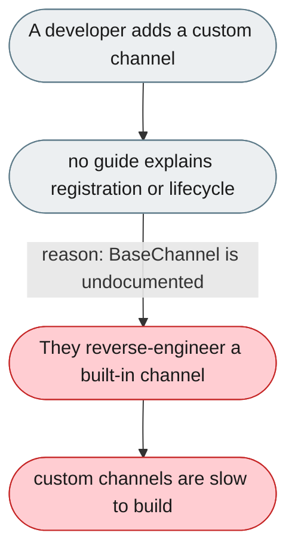
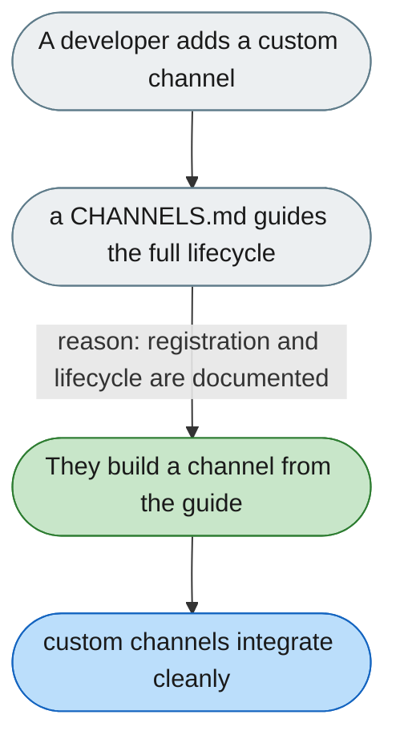

[← Index](../../../README.md) · jiuwenswarm Usability Review

---

# Writing a custom channel has no developer guide

*Concern: Integration & Local Development*

---

## The problem today

`BaseChannel` is a clean interface with 11 built-in reference channels, but there's no `CHANNELS.md` — registration, the lifecycle contract, and the `Message`/`E2AEnvelope` relationship are all undocumented.

---

## The proposed fix

A `CHANNELS.md` with when-to-write guidance, the full lifecycle, a minimal ~80-line example, registration, and the `RoutingTarget` model.

Concern: [Integration & Local Development](README.md).
