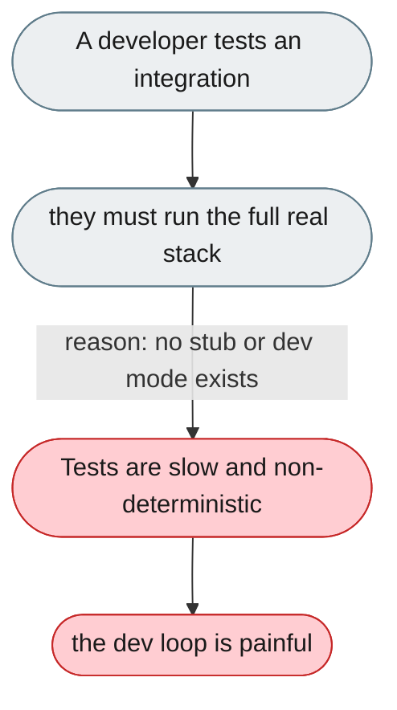
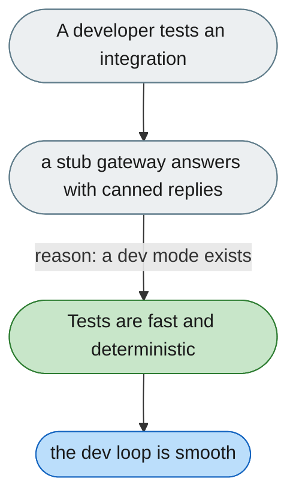

[← Index](../../../README.md) · jiuwenswarm Usability Review

---

# No local stub or dev mode for testing integrations

*Concern: Integration & Local Development*

---

## The problem today

Testing an integration means running the full real stack (agent + gateway + model API) — slow, expensive, and non-deterministic; there's no stub, echo mode, playback, or Docker Compose for CI.

---

## The proposed fix

A `jiuwenswarm-dev --stub` mode serving canned replies with no LLM/keys, plus a Docker Compose file for the real stack in one command.

Concern: [Integration & Local Development](README.md).
