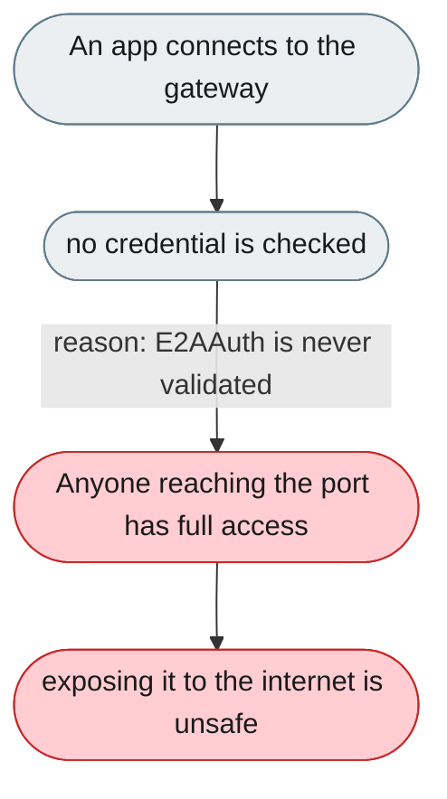
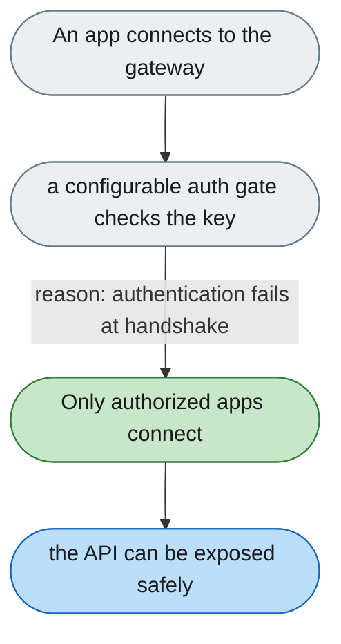

[← Index](../../../README.md) · jiuwenswarm Usability Review

---

# The API has no authentication and is open by default

*Concern: Connection Security*

---

## The problem today

`E2AAuth` is carried but never validated — anyone reaching the WebSocket port can send any request; the only protection is not exposing the port.

---

## The proposed fix

A configurable gateway auth gate (`none` / `api_key` / `bearer`) that rejects unauthenticated connections at the WebSocket handshake (401), not after.

Concern: [Connection Security](README.md).
