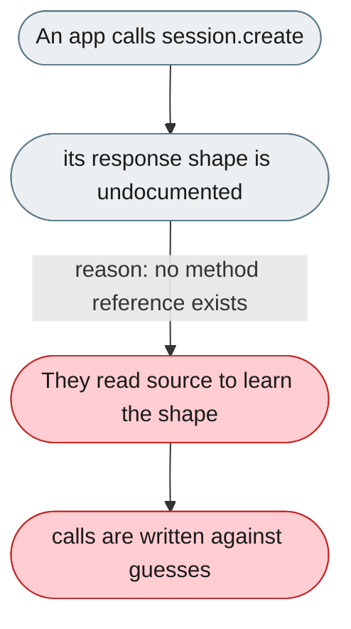
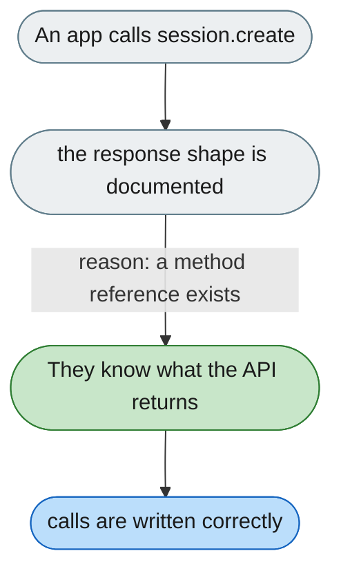

[← Index](../../../README.md) · jiuwenswarm Usability Review

---

# Session API methods have no documented response shapes

*Concern: Transport & Protocol*

---

## The problem today

The E2A session lifecycle (~30 methods) has no documented request/response shapes — a developer must read `session_metadata.py` to learn what `session.create` returns.

---

## The proposed fix

A method reference (or the [E2A AsyncAPI spec](2-the-e2a-protocol-spec-is-prose-not-a-machine-readable-schema.md)) listing every method's params and response data.

Concern: [Transport & Protocol](README.md).
