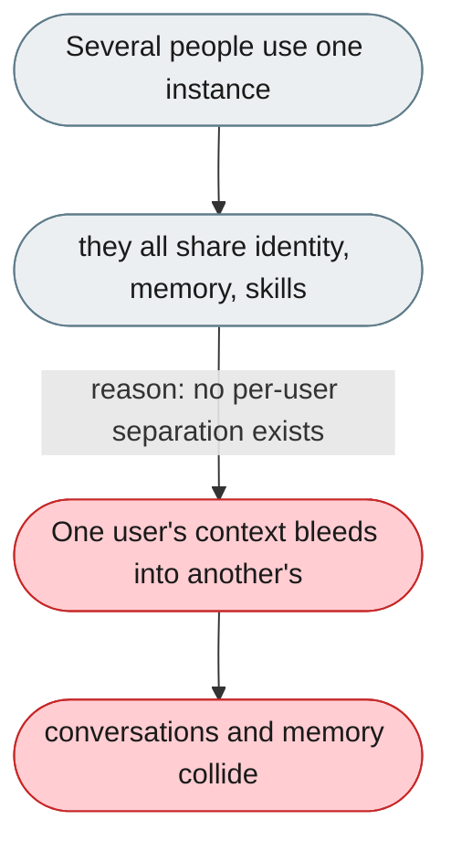
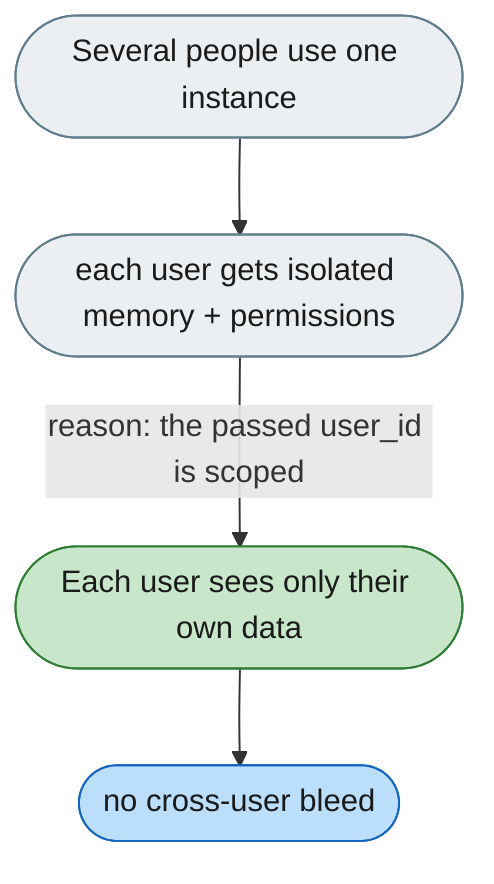

[← Index](../../../README.md) · jiuwenswarm Usability Review

---

# All users share one identity, memory and permissions

*Concern: Identity & Isolation*

---

## The problem today

The Web UI has no login — everyone shares one identity, memory, and skills; there's no "this belongs to user A, not B."

---

## The proposed fix

For shared/channel deployments, isolate memory and permissions per user. The channel integration already passes `user_id` — plumb it into memory and permission scoping.

Concern: [Identity & Isolation](README.md).
