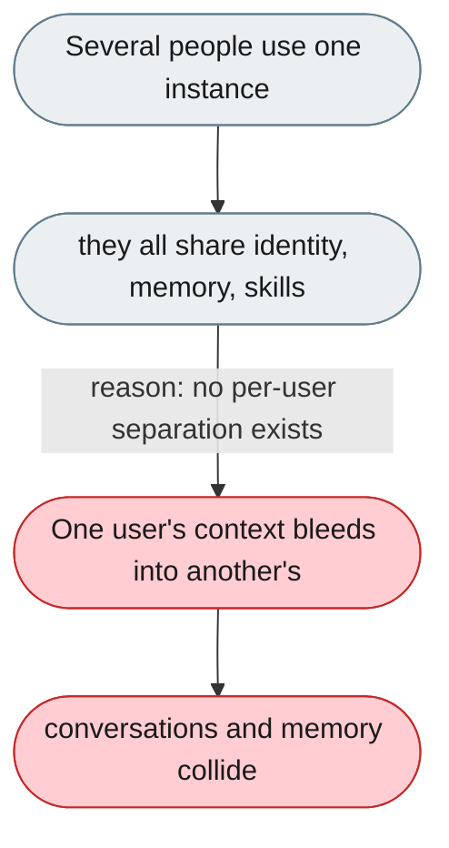
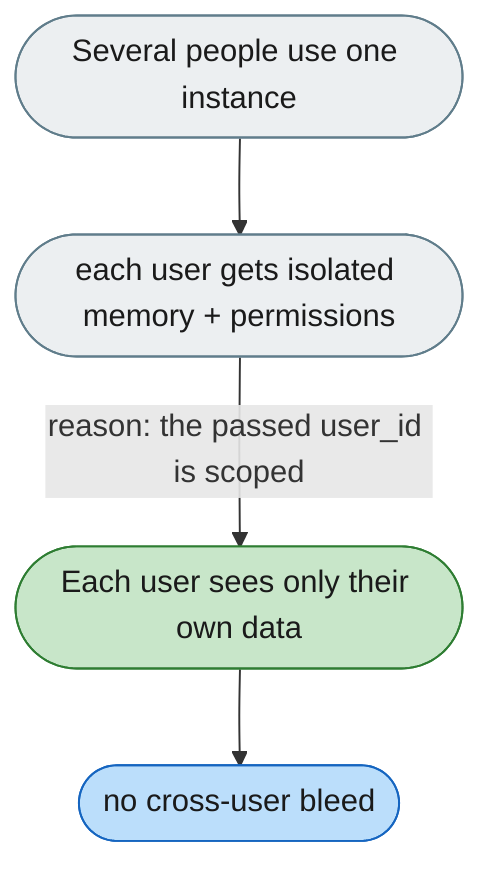

[← Index](../../../README.md) · jiuwenswarm Usability Review

---

# No login on the Web UI: local Web users share one identity

*Concern: Identity & Isolation*

---

## The problem today

The Web UI has no login, so everyone who uses a given Web UI instance shares the same (empty) identity, its sessions, and its memory. This is not true across the system as a whole: channel users (Feishu/Telegram/WeChat) are carried with distinct `user_id`s, which the server scopes sessions and memory by. The gap is specifically the no-login Web surface — it becomes a problem only when more than one person uses the same Web instance.

---

## The proposed fix

For shared/channel deployments, isolate memory and permissions per user. The channel integration already passes `user_id` — plumb it into memory and permission scoping.

Concern: [Identity & Isolation](README.md).
