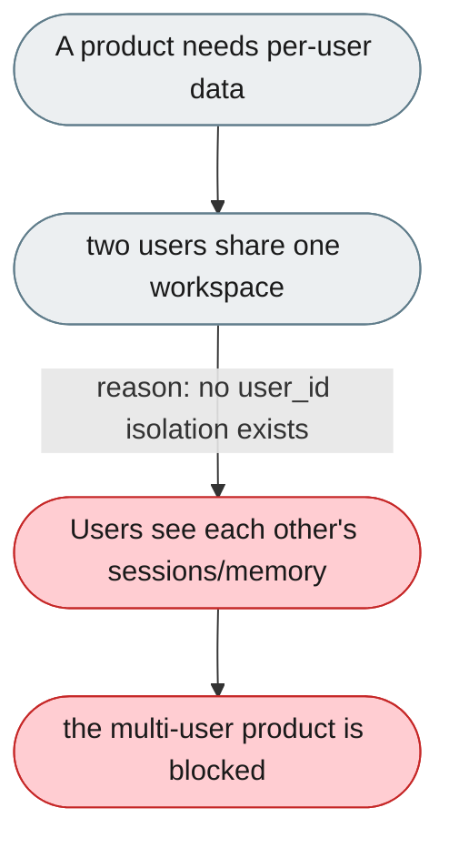
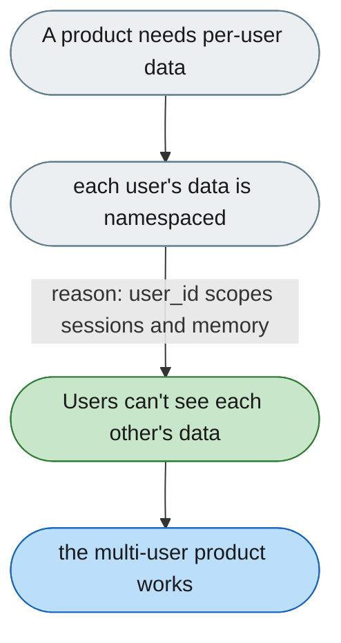

[← Index](../../../README.md) · jiuwenswarm Usability Review

---

# No multi-tenancy: every user shares one workspace

*Concern: Identity & Isolation*

---

## The problem today

jiuwenswarm is single-workspace: `user_id` is only for logging/routing, so two users share memory and can see each other's sessions. This blocks multi-user products (the workaround is one instance per user).

---

## The proposed fix

A `user_id`-scoped isolation layer: sessions, memory (`USER.md`/`MEMORY.md`), and (optionally) skills scoped per user via namespace prefixes like `~/.jiuwenswarm/users/{user_id}/sessions/` — no separate processes.

Concern: [Identity & Isolation](README.md).
