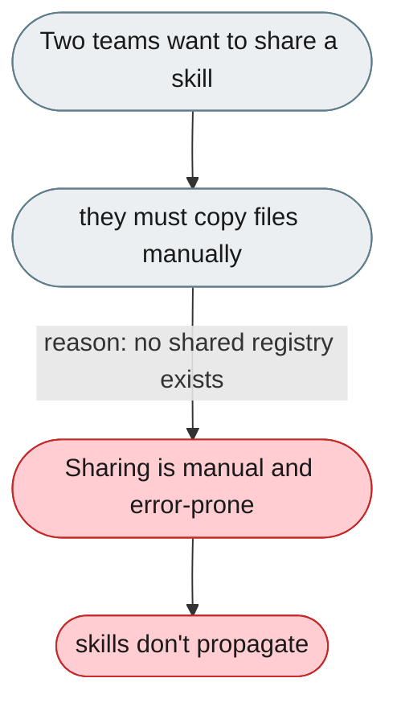
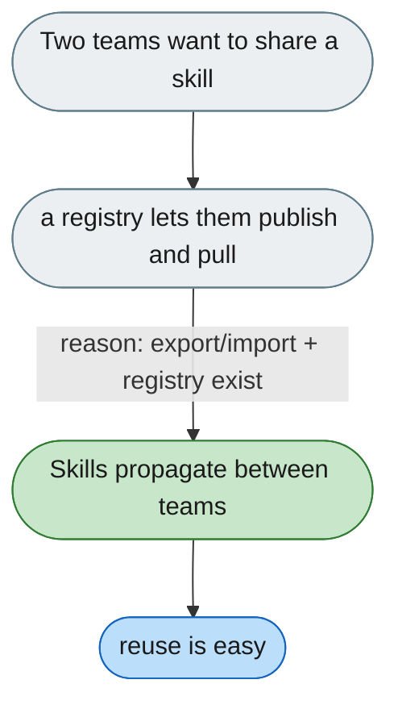

[← Index](../../../README.md) · jiuwenswarm Usability Review

---

# No shared skill library across instances

*Concern: Shared Skill Library*

---

## The problem today

Skills are per-workspace; two operators can't share a skill across instances without manually copying files. This is about sharing skills **across separate instances**, which is a different axis from scoping skills *per user within one instance* (that is the multi-tenancy concern).

---

## The proposed fix

A `.skill.zip` export/import format and a shared skill registry to publish and pull from — surfaced as the primary distribution mechanism.

Concern: [Shared Skill Library](README.md).
