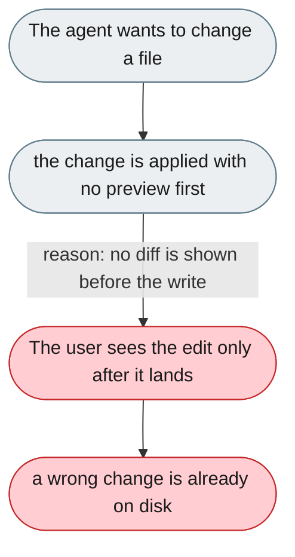
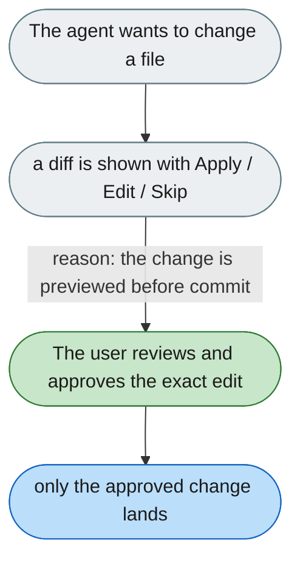

[← Index](../../../README.md) · jiuwenswarm Usability Review

---

# File changes are applied with no preview or approval

*Concern: Approval & Preview*

---

## The problem today

The agent can create, edit, and delete files in the project directory. The Web UI has a `CodeChangesCard` in `ChatPanel/index.tsx`, but it is unclear whether it previews changes before they are made or just summarizes them after.



---

## The proposed fix

Before committing any file write, show a diff in the chat panel:

```
Proposed change to src/parser.py:
- def parse(file):
+ def parse(file, encoding="utf-8"):
[Apply] [Edit] [Skip]
```

This requires separating the "compute change" step from the "commit change" step — architecturally non-trivial, but the highest-leverage trust feature in a coding assistant.



Concern: [Approval & Preview](README.md).
