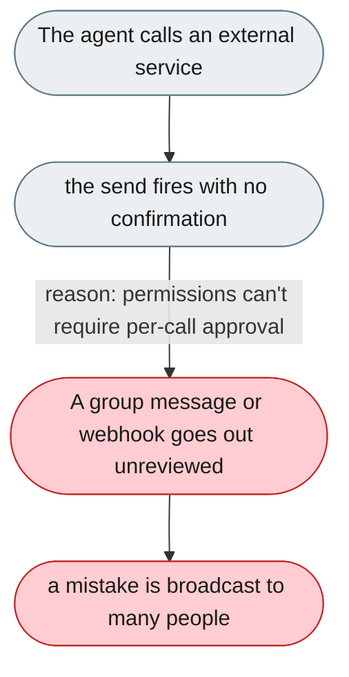
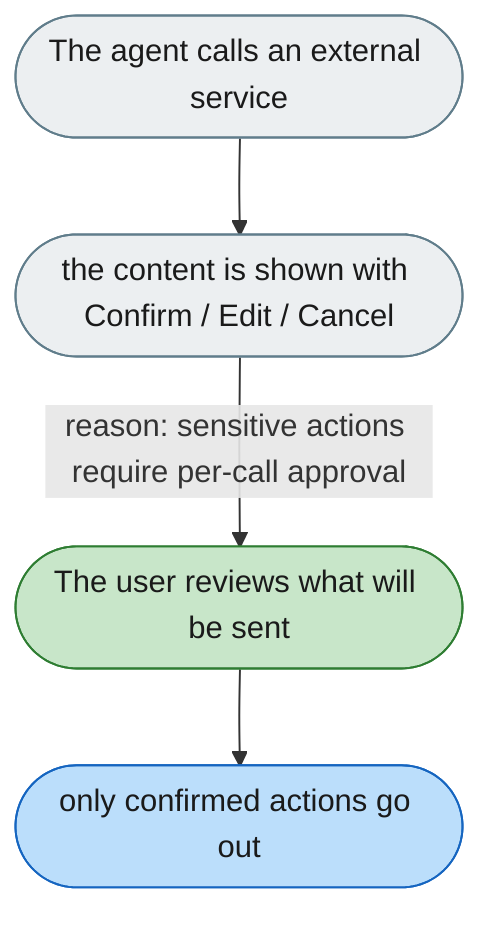

[← Index](../../../README.md) · jiuwenswarm Usability Review

---

# Destructive external actions fire without confirmation

*Concern: Approval & Preview*

---

## The problem today

The agent can send messages to Feishu groups, publish to external APIs, and call webhooks — all without a confirmation step. Permissions can block tools entirely, but cannot require per-call confirmation for sensitive actions.

---

## The proposed fix

A "confirm before send" mode for external-impact tools. Before `send_feishu_message` or any external webhook, show the message content with Confirm / Edit / Cancel — essential for group messages where mistakes are visible to many.

Concern: [Approval & Preview](README.md).
