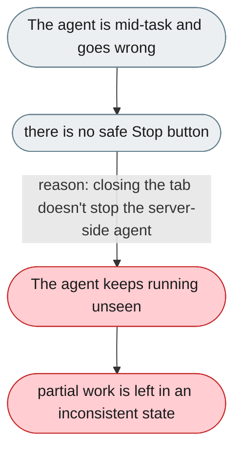
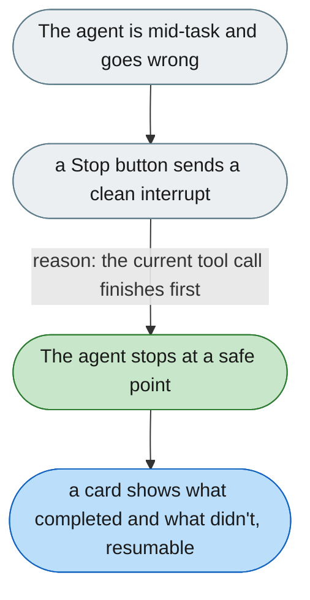

[← Index](../../../README.md) · jiuwenswarm Usability Review

---

# No stop button that safely interrupts the agent

*Concern: Stop, Resume & Undo*

---

## The problem today

There is no Stop button with defined behaviour. The user can close the tab or kill the process, but the agent may keep running on the server, leaving partial writes or calls in an inconsistent state.

---

## The proposed fix

A Stop button in the chat panel header that: (1) sends an interrupt to the harness, (2) waits for the current tool call to finish (not mid-write), (3) shows a "Stopped" card listing what completed and what did not, and (4) leaves the conversation resumable with "continue".

Concern: [Stop, Resume & Undo](README.md).
