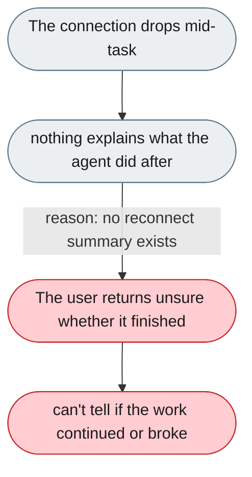
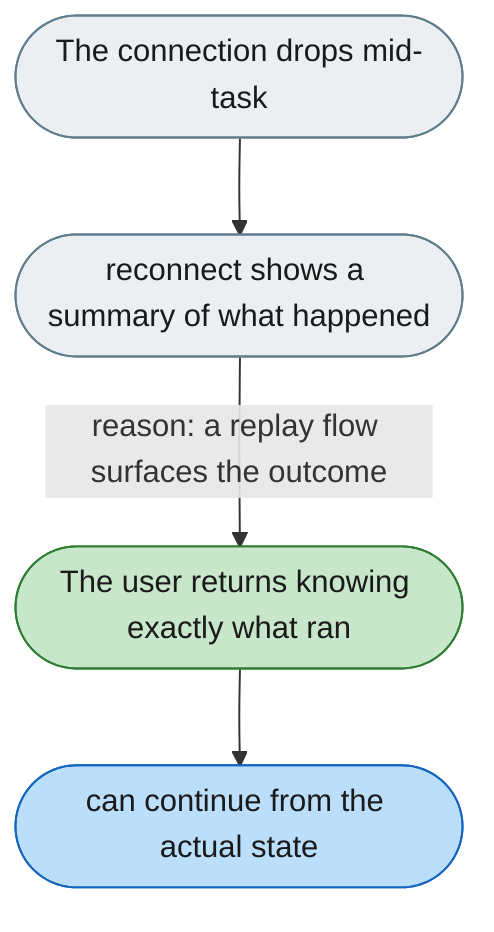

[← Index](../../../README.md) · jiuwenswarm Usability Review

---

# Unclear what the agent does when a session disconnects

*Concern: Stop, Resume & Undo*

---

## The problem today

If the tab closes or the WebSocket drops mid-task, it is not documented or visible whether the agent continues, stops, or is undefined. There is no reconnect flow showing what happened during the disconnect.

---

## The proposed fix

On reconnect, immediately show what the agent did while away ("completed 4 steps and wrote 2 files — summary"), its current step if still running, or the error if it failed. Server-side behaviour during a disconnect must be documented, not assumed.

Concern: [Stop, Resume & Undo](README.md).
