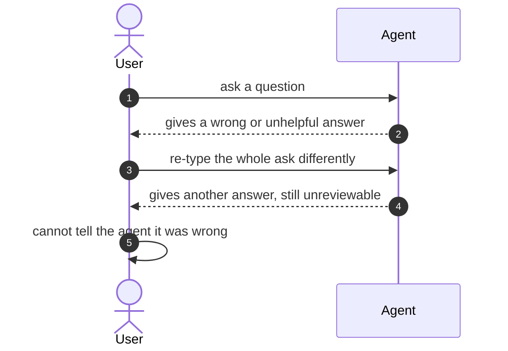
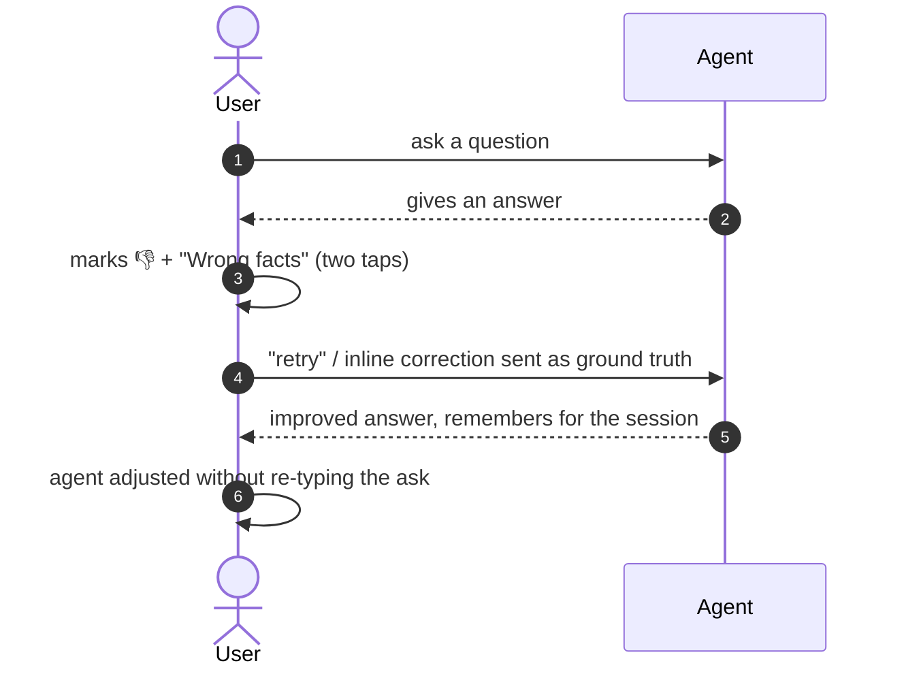

[← Index](../../../README.md) · jiuwenswarm Usability Review

---

# No way to rate, retry or correct an agent answer

*Concern: Errors & Feedback*

---

## The problem today

The only feedback mechanism found is on `ProactiveRecommendationCard` (thumbs up/down for skill recommendations, stored in localStorage). There is no feedback on ordinary assistant messages: no thumbs down, no "regenerate", no "that was wrong", no inline correction.

---

## The proposed fix

Give every assistant message a lightweight way to react and correct:

- A 👍/👎 and "retry" row that regenerates the last response.
- Thumbs-down optionally opens a micro-form: "Wrong facts" / "Too long" / "Didn't follow my instruction" / "Other" — two taps, no typing.
- A "correct this" mode to edit the agent's answer inline and mark that edit as the session's ground truth.
- Corrections feed back into the session context so the agent adjusts without the user re-explaining.

Concern: [Errors & Feedback](README.md).
