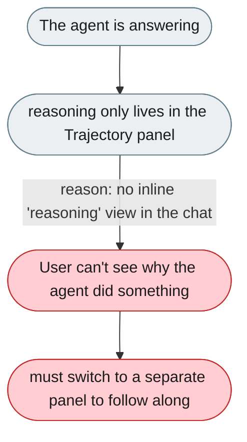
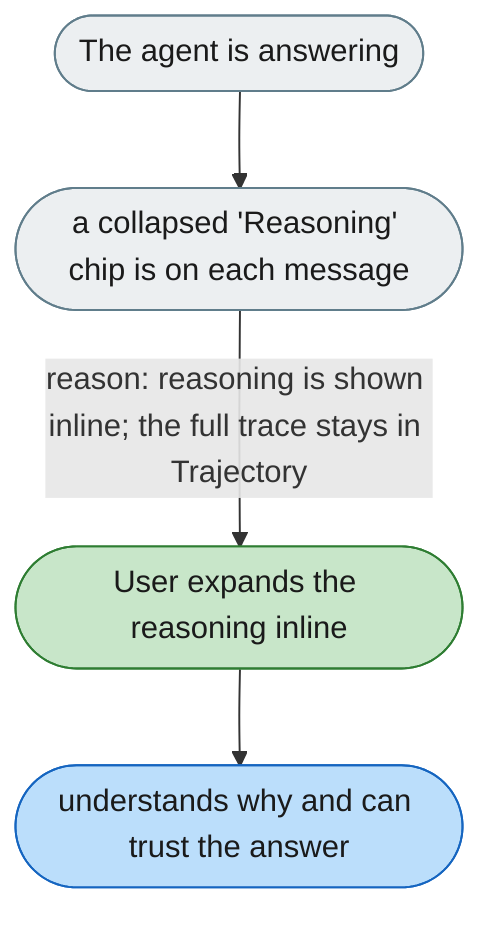

[← Index](../../../README.md) · jiuwenswarm Usability Review

---

# Agent reasoning is hidden in a separate panel

*Concern: Agent Explanation*

---

## The problem today

`TrajectoryTable.tsx` shows `thinkingDetail` per trajectory cell, but only inside the Trajectory panel — a separate panel the user must know to open. During a conversation the user sees only streaming text and tool-call cards.

---

## The proposed fix

Two levels of transparency:

- **Inline (default):** a collapsed "Reasoning" chip on each assistant message; clicking expands the thinking inline, no panel switch.
- **Full (Trajectory panel):** the structured trace with timing, tokens, and tool details.

The chip shows the first 1–2 sentences of reasoning as a preview before expanding.

Related: [The activity view is hidden behind an unclear name](../../onboarding/navigation-and-settings/3-the-activity-view-is-hidden-behind-an-unclear-name.md).
