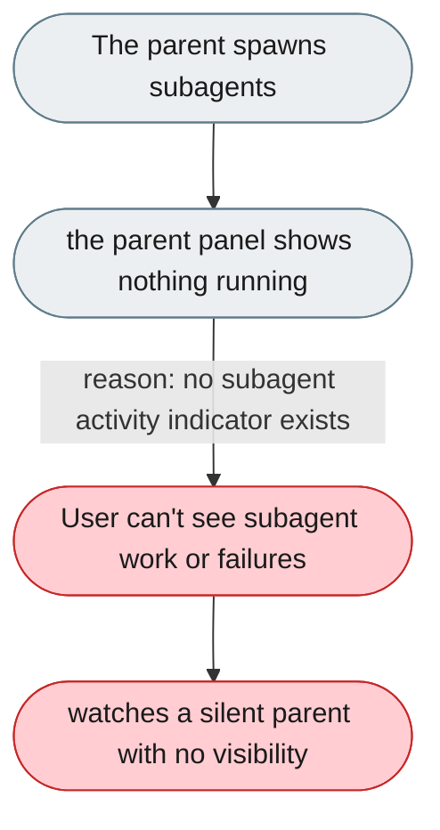
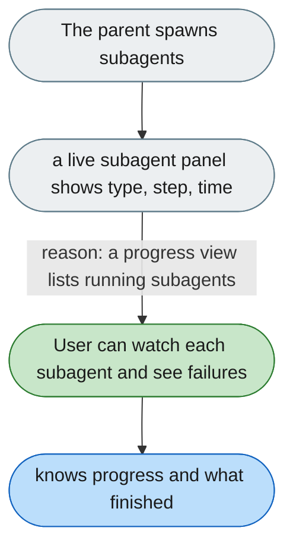

[← Index](../../../README.md) · jiuwenswarm Usability Review

---

# Subagents work invisibly with no progress view

*Concern: Agent Explanation*

---

## The problem today

When `subagent_spawn` is called, the parent panel shows nothing about running subagents — not what they're doing, how many, or whether any failed.

---

## The proposed fix

A live subagent activity panel (the `TeamArea` component already exists for team mode; apply it to on-demand subagents):

- a list of active subagents with type, current step, and elapsed time;
- clicking a subagent opens its own trajectory or streaming output;
- when all finish, a summary: "3 subagents finished in 28s."

Concern: [Agent Explanation](README.md).
