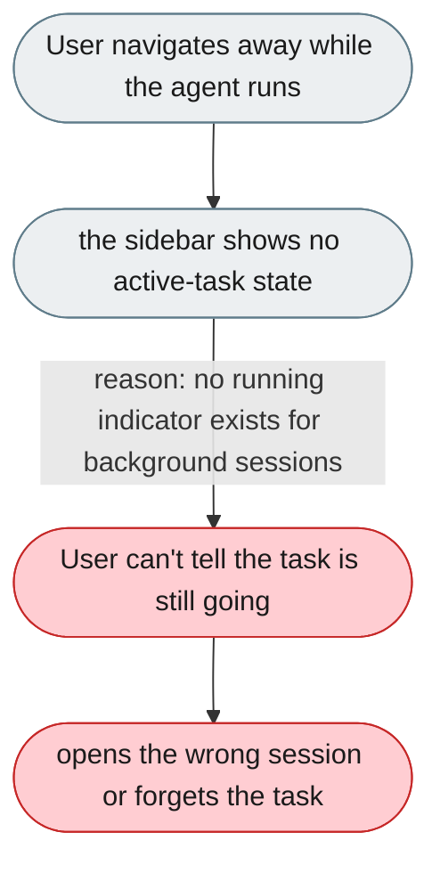
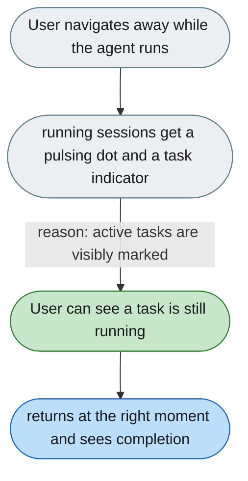

[← Index](../../../README.md) · jiuwenswarm Usability Review

---

# Background tasks look identical to idle sessions

*Concern: Messages, History & Notifications*

---

## The problem today

When the user navigates to another session while the agent is running, nothing in the sidebar shows that a session has an active task. The active session shows a processing state, but background sessions are silent.

---

## The proposed fix

- A pulsing dot on sessions running in the background in `ConversationSidebar`.
- A global "Running tasks" indicator in the `SessionSidebar` nav.
- When a background task completes, a badge on the session and a non-blocking toast: "Session 'Invoice task' completed."

Concern: [Messages, History & Notifications](README.md).
