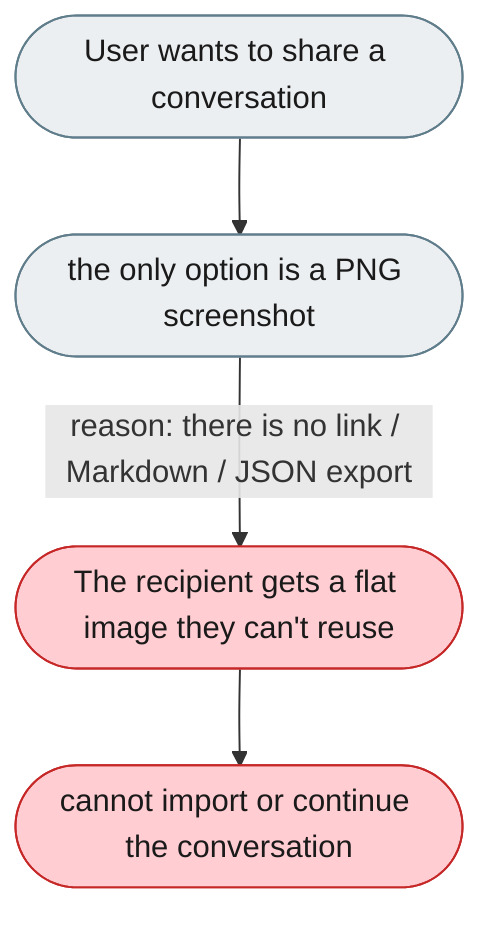
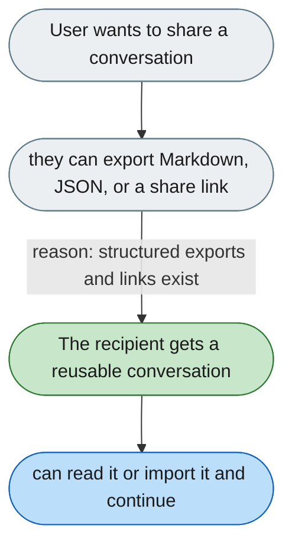

[← Index](../../../README.md) · jiuwenswarm Usability Review

---

# Conversations can only be shared as a flat image

*Concern: Messages, History & Notifications*

---

## The problem today

`shareImageExport.tsx` converts the chat to a PNG image — the only sharing mechanism. There is no way to share a conversation as a link, Markdown, or JSON that someone could import.

---

## The proposed fix

- **Export as Markdown** (turns formatted as `**User:** / **Agent:**`).
- **Export as JSON** (full structured conversation for importing elsewhere).
- **Share link** (if the instance has a public URL).

Concern: [Messages, History & Notifications](README.md).
