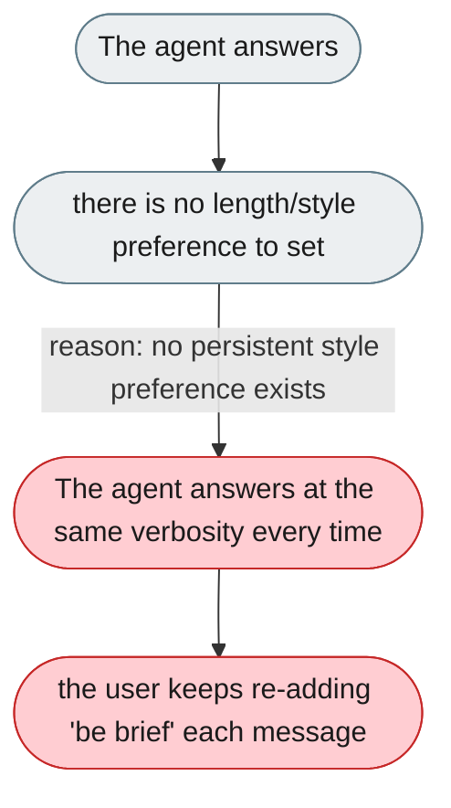
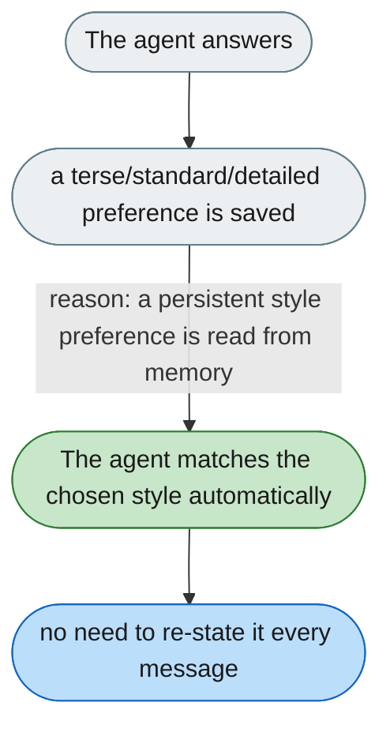

[← Index](../../../README.md) · jiuwenswarm Usability Review

---

# No control over reply length or writing style

*Concern: Output & Perceived Speed*

---

## The problem today

There is no global setting or per-message instruction for response length or style. If the agent tends to be verbose, the user must type "be brief" into every single message.

---

## The proposed fix

A persistent preference (saved to MEMORY.md or user config) for response style — terse / standard / detailed — plus a per-message override via a small pill next to the send button. The agent reads the preference from memory and applies it without being reminded.

Concern: [Output & Perceived Speed](README.md).
