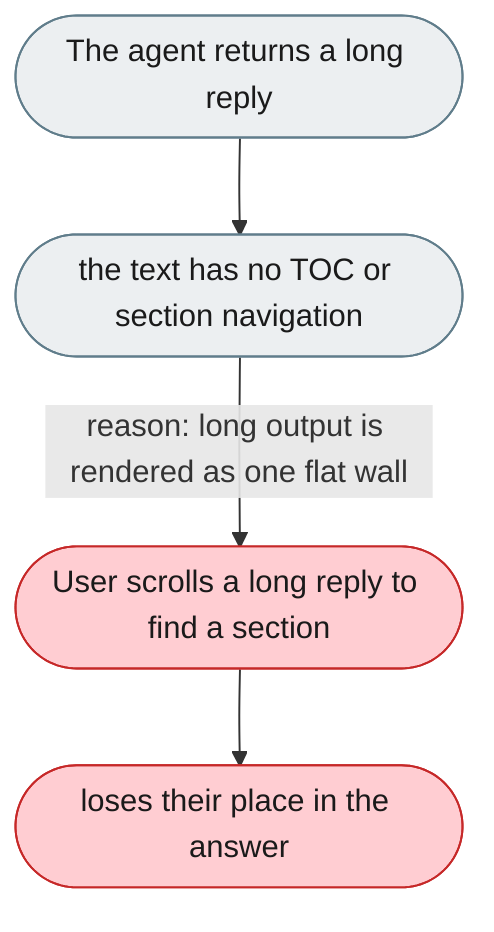
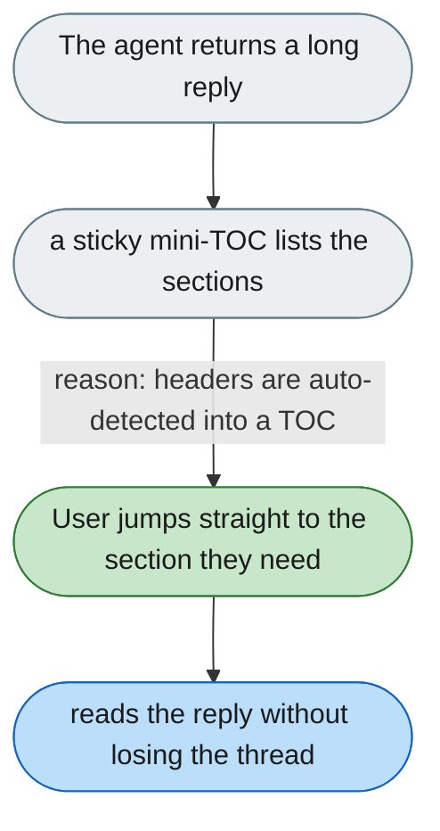

[← Index](../../../README.md) · jiuwenswarm Usability Review

---

# Long agent replies have no structure aids

*Concern: Output & Perceived Speed*

---

## The problem today

`StreamingContent.tsx` renders text with a simple whitespace-preserving display. Long multi-section agent responses have no table of contents, no jump-to-section, and no folding.

---

## The proposed fix

Auto-detect headers in agent output (`## Section`) and render a sticky mini-TOC at the top of the message panel for long responses, with collapsible sections for code blocks and long reasoning.

Concern: [Output & Perceived Speed](README.md).
