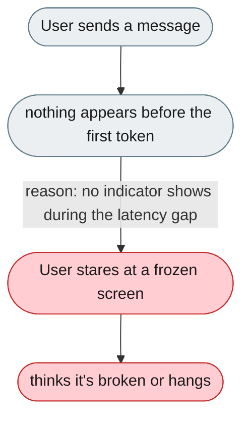
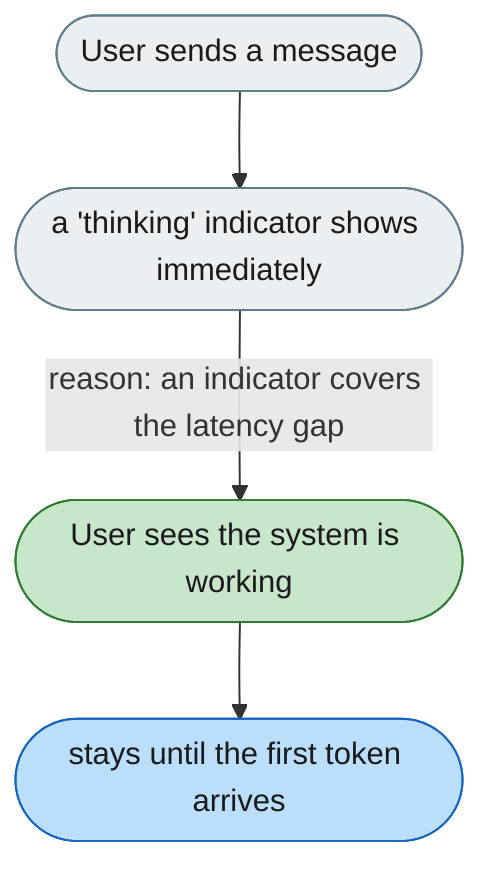

[← Index](../../../README.md) · jiuwenswarm Usability Review

---

# Nothing is shown while waiting for the first token

*Concern: Output & Perceived Speed*

---

## The problem today

`StreamingContent.tsx` renders tokens as they arrive, but between submitting a message and the first token there is a gap (warm-up, context assembly, routing). During that gap the user sees nothing — no spinner, no progress.

---

## The proposed fix

Show an animated "thinking" indicator (three dots / pulsing bar) the moment the message is submitted, removed when the first token arrives. `HarnessProgressBar` already exists — it should be visible from submit.

Concern: [Output & Perceived Speed](README.md).
