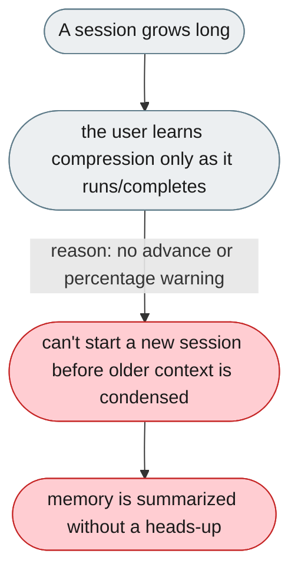
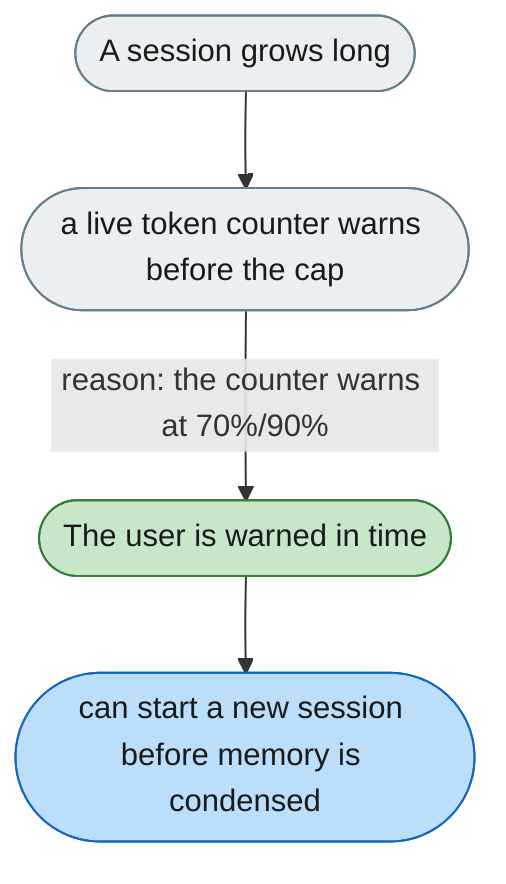

[← Index](../../../README.md) · jiuwenswarm Usability Review

---

# No advance warning before context compression

*Concern: Output & Perceived Speed*

---

## The problem today

When a session gets long, older context is proactively compressed (summarized). The UI does surface this **in-conversation while it runs and after it completes** (`ContextCompressionLines`: a "compressing…" line, then "N places compressed" with a summary). But there is no **advance** warning: the user only learns compression is happening once it has already started, and there is no live token/percentage gauge to prompt them to start a new session before memory is condensed.

The compression itself is announced in-chat with a summary; what's missing is a heads-up **before** it triggers.

---

## The proposed fix

A small live token counter in the chat input area. At ~70% it turns yellow; at ~90% it warns "Approaching context limit — older messages may be summarized." That gives the user time to start a new session before the agent's older context is condensed.

Concern: [Output & Perceived Speed](README.md).
