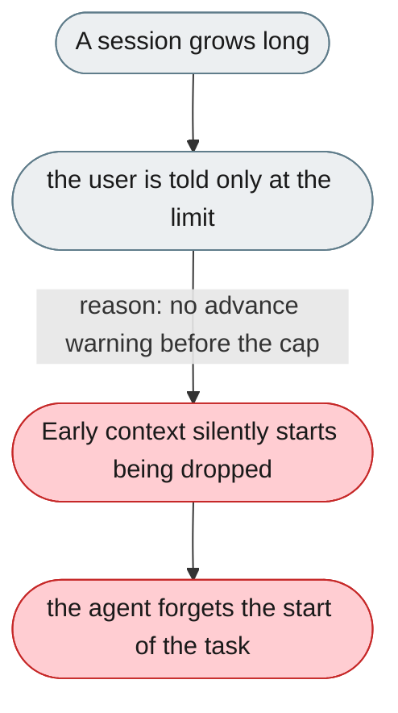
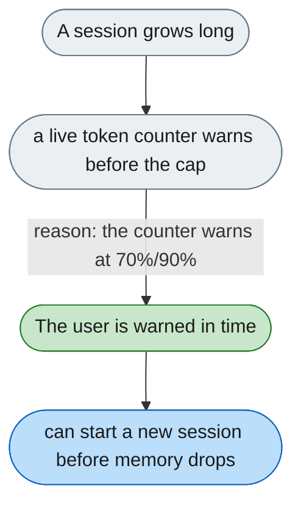

[← Index](../../../README.md) · jiuwenswarm Usability Review

---

# No warning before the context limit drops early memory

*Concern: Output & Perceived Speed*

---

## The problem today

There is a proactive notification for "context limit reached" via WebSocket, but it fires only at the limit — users get no advance warning before early context starts being dropped.

---

## The proposed fix

A small token counter in the chat input area. At ~70% it turns yellow; at ~90% it warns "Approaching context limit — older messages may be summarized." That gives the user time to start a new session before the agent forgets.

Concern: [Output & Perceived Speed](README.md).
