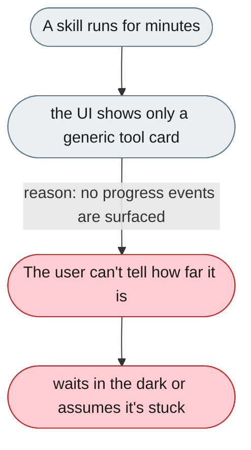
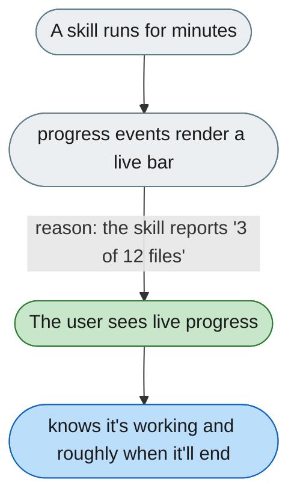

[← Index](../../../README.md) · jiuwenswarm Usability Review

---

# Long-running skills show no progress

*Concern: Output & Perceived Speed*

---

## The problem today

When a skill is executing (potentially for minutes), the user sees only a generic tool-call card — no progress bar, step count, or estimate.

---

## The proposed fix

Skills should emit progress events that render as a live progress bar in the tool card — "parse-invoice: processed 3 of 12 files…". This needs a lightweight progress protocol in the harness; the UI (`HarnessProgressBar`) already exists.

Concern: [Output & Perceived Speed](README.md).
