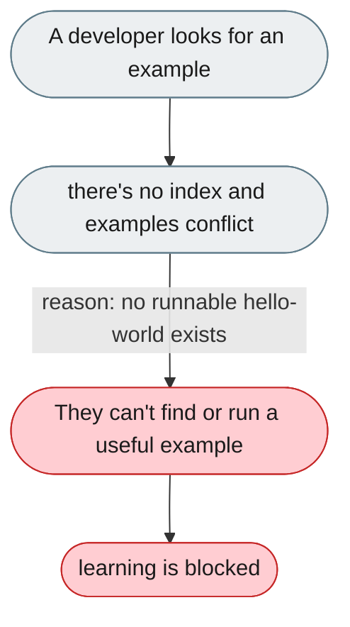
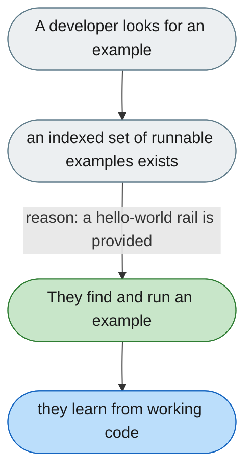

[← Index](../../../README.md) · jiuwenswarm Usability Review

---

# The examples directory is undiscoverable and inconsistent

*Concern: Extension Documentation & Stability*

---

## The problem today

`examples/` has no README index, mixes `BaseSecurityRail` with `DeepAgentRail`, has non-runnable quickstarts (need a DB), and lacks the simplest case (add a line to the system prompt).

---

## The proposed fix

An `examples/README.md` (what/prereqs/expected output) and a one-file `00_hello_rail/` that just prints "My rail ran".

Concern: [Extension Documentation & Stability](README.md).
