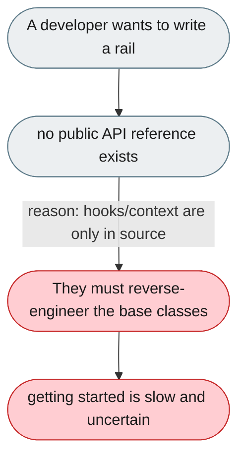
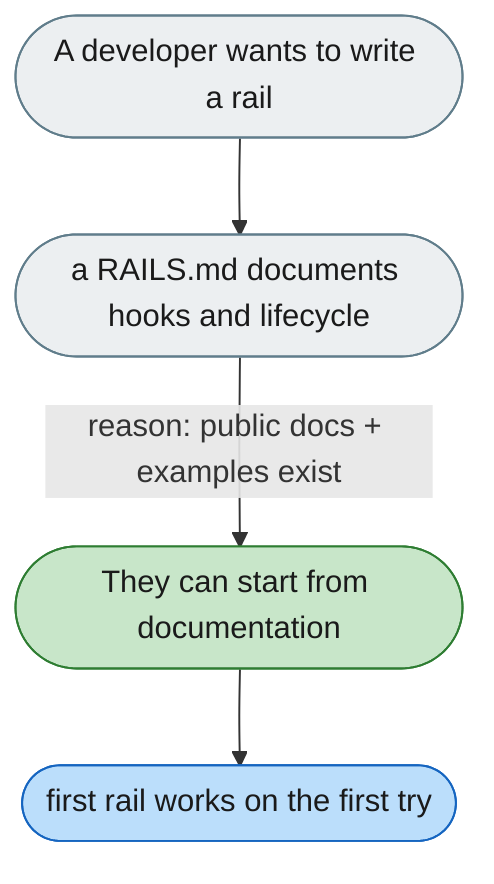

[← Index](../../../README.md) · jiuwenswarm Usability Review

---

# The rail extension API has no public documentation

*Concern: Rails & Context API*

---

## The problem today

The rail system is the primary extension point, but `AgentRail` (10 hooks) and `DeepAgentRail` (+2) have no public reference page — a developer must read both source files, and the only written description is in Chinese docs.

---

## The proposed fix

A `RAILS.md` at the root (or `docs/en/rails.md`) explaining what a rail is, the full hook lifecycle in order, a paste-and-run example, and common patterns; the `DeepAgentRail` docstring lists all 12 hooks.

Concern: [Rails & Context API](README.md).
