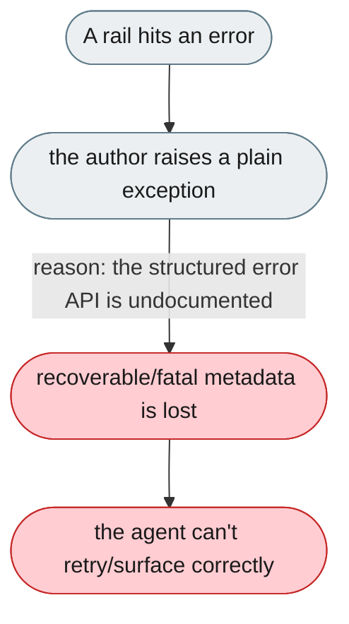
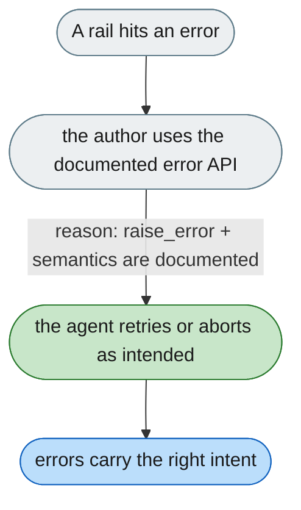

[← Index](../../../README.md) · jiuwenswarm Usability Review

---

# The structured error API isn't documented for rail authors

*Concern: Rails & Context API*

---

## The problem today

A rail that hits an error either raises a plain exception (losing `recoverable`/`fatal`/`code`) or must discover an undocumented error framework (`raise_error`).

---

## The proposed fix

Document the error framework in the rail guide, showing `raise_error(StatusCode..., recoverable=...)` — `recoverable=True` retries, `False` aborts.

Concern: [Rails & Context API](README.md).
