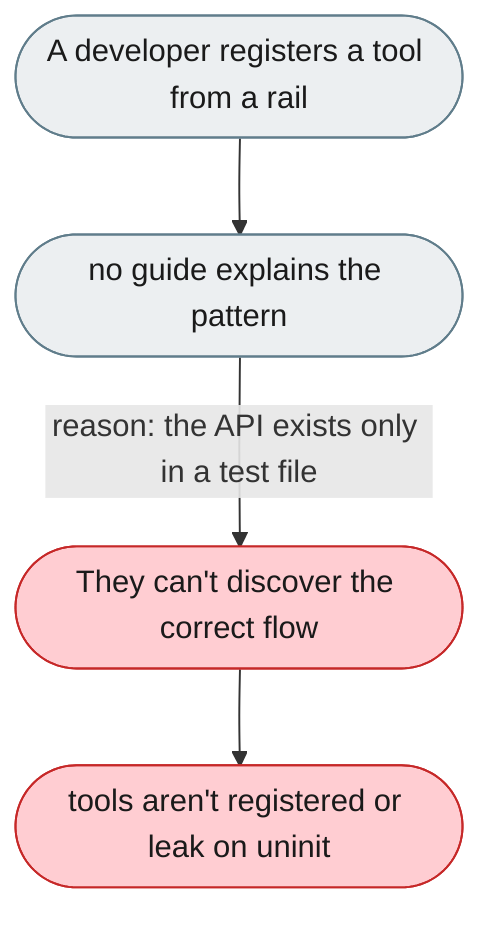
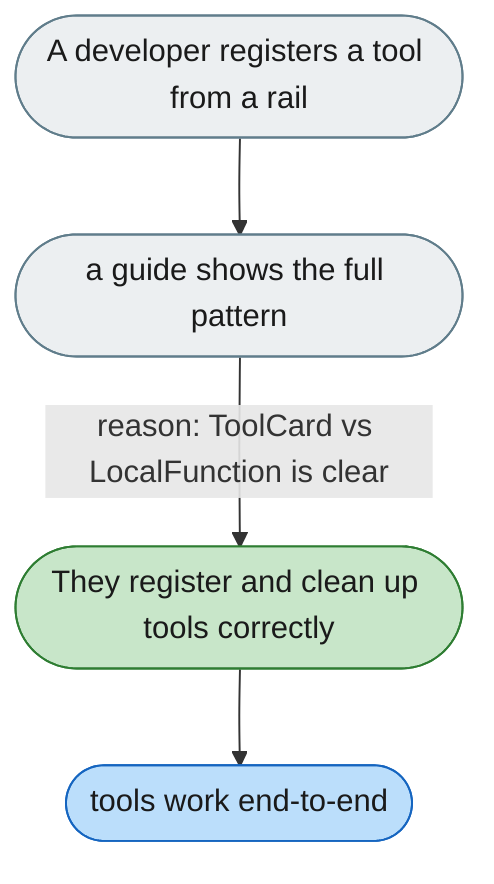

[← Index](../../../README.md) · jiuwenswarm Usability Review

---

# Registering tools from a rail has no developer guide

*Concern: Tools & Agent Factory*

---

## The problem today

Registering a tool from a rail requires knowing `ability_manager.add(ToolCard)`, cleanup in `uninit()`, and that `input_params` is a JSON Schema — all only visible in a test file, with the `ToolCard`/`LocalFunction` split unexplained.

---

## The proposed fix

An "Adding a tool from a rail" guide with the full pattern, and a diagram of `ToolCard` (schema the LLM sees) vs `LocalFunction` (the Python that runs).

Concern: [Tools & Agent Factory](README.md).
