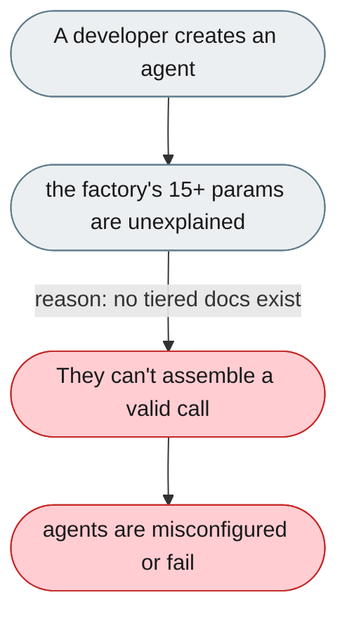
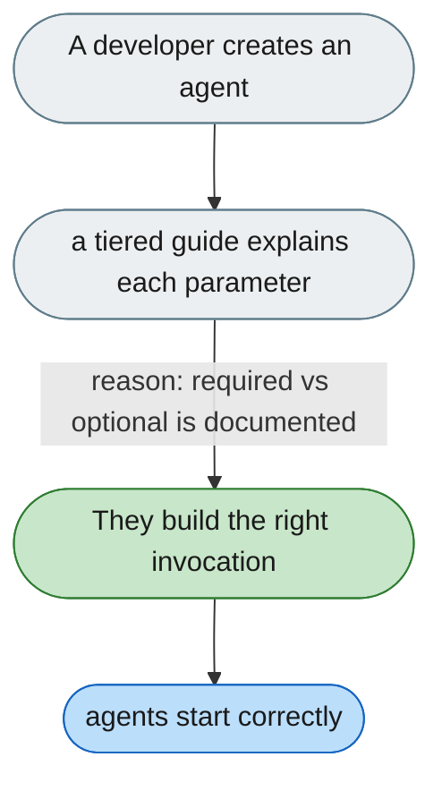

[← Index](../../../README.md) · jiuwenswarm Usability Review

---

# The agent factory has too many undocumented parameters

*Concern: Tools & Agent Factory*

---

## The problem today

`create_deep_agent()` takes 15+ parameters with no docs on which are required, what `sys_operation`/`workspace` mean, or how passing `tools` differs from a rail.

---

## The proposed fix

A tiered guide — minimum invocation, + workspace/rails, + subagents/sys_operation — and an inline docstring covering each parameter.

Concern: [Tools & Agent Factory](README.md).
