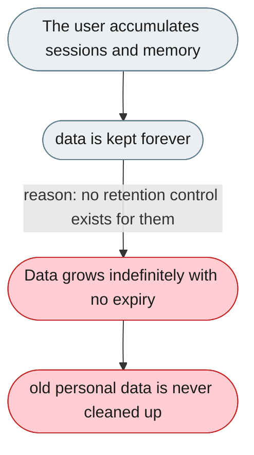
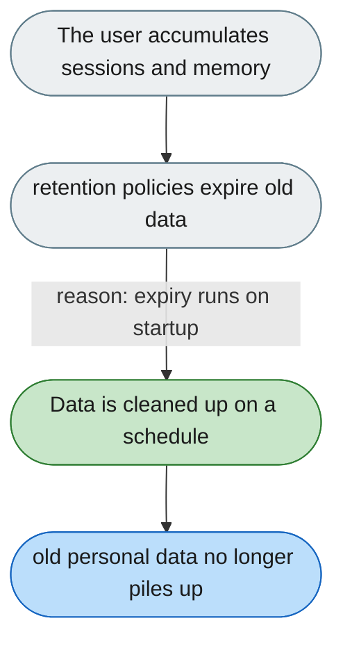

[← Index](../../../README.md) · jiuwenswarm Usability Review

---

# Data is kept indefinitely with no expiry controls

*Concern: Data Retention*

---

## The problem today

Memory and conversation history are stored indefinitely. There is a `trajectory_ui.retention_days` option, but no equivalent for conversations or memory.

---

## The proposed fix

A retention settings panel with instance-wide defaults and per-user preferences: "Keep conversation history for: 30 / 90 / 365 / forever", "Keep daily memory for: 7 / 30 / 90 / forever", "Delete all data older than X". Expiration runs on startup; in shared deployments admins can set a maximum users cannot exceed.

Concern: [Data Retention](README.md).
