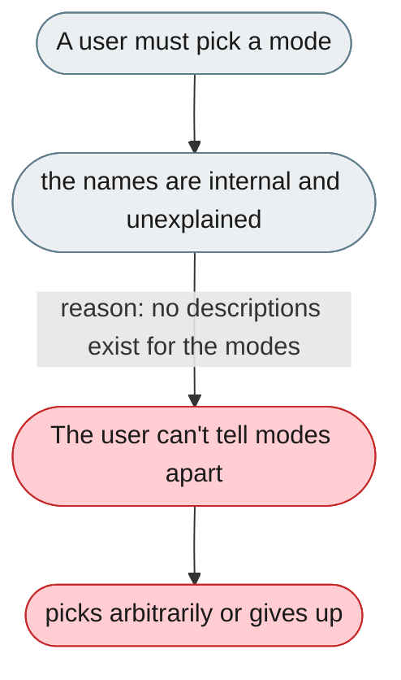
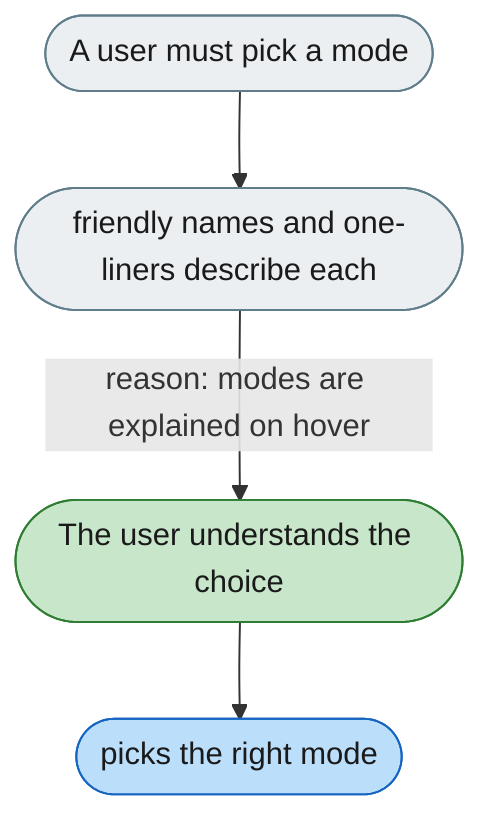

[← Index](../../../README.md) · jiuwenswarm Usability Review

---

# Agent modes have no user-facing names or descriptions

*Concern: Empty States & Choosing a Mode*

---

## The problem today

Modes — `agent`, `code`, `cluster`, `team`, `agent.plan`, `agent.fast` — are named from the implementation. The selector has no tooltip or one-liner, so a new user can't choose informedly.

---

## The proposed fix

Name modes by the user's goal (Standard / Fast / Plan first / Code / Multi-agent / Team) with a one-liner each, shown on hover, plus a first-time recommendation ("try Standard").

Concern: [Empty States & Choosing a Mode](README.md).
