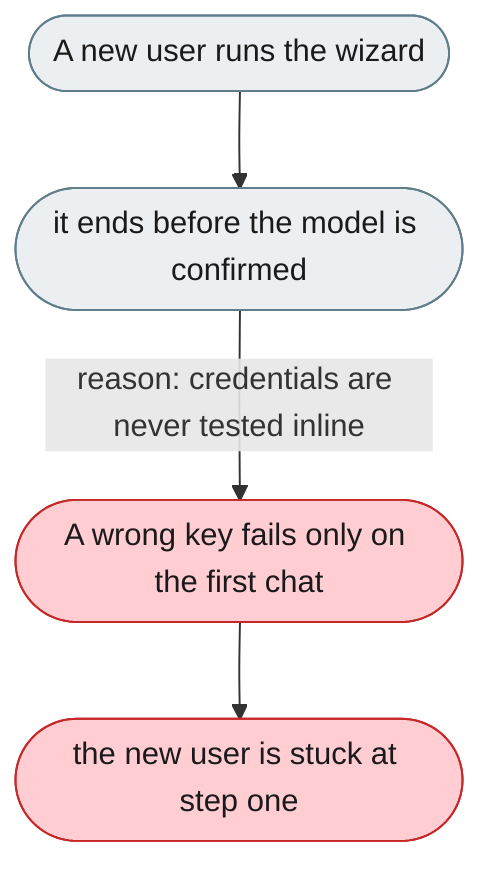
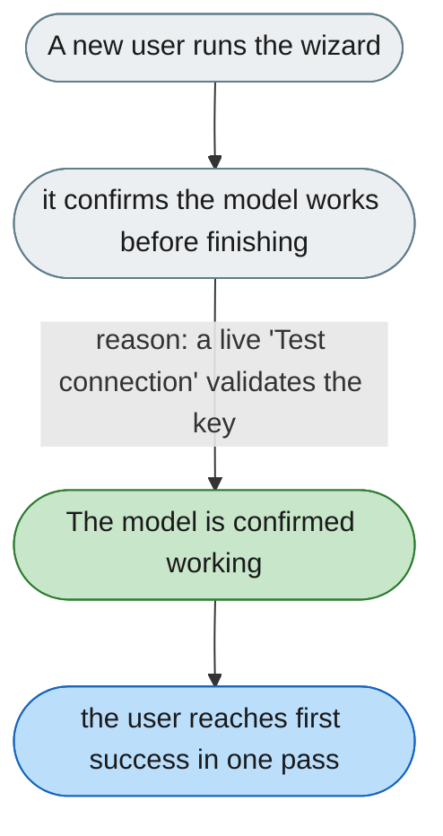

[← Index](../../../README.md) · jiuwenswarm Usability Review

---

# Setup wizard ends before the model is confirmed working

*Concern: First Run*

---

## The problem today

`ModelSetupGuide.tsx` runs a 3-step tour that ends at the models panel. The user must figure out credentials alone, and a misconfigured model only errors on the first chat.

---

## The proposed fix

The wizard finishes only after one successful message, every step testable inline: welcome, choose provider, enter key with a live "Test connection" ✓/✗, optional channel setup, then a prefilled first message. Re-enterable from a `?` icon.

Concern: [First Run](README.md).
