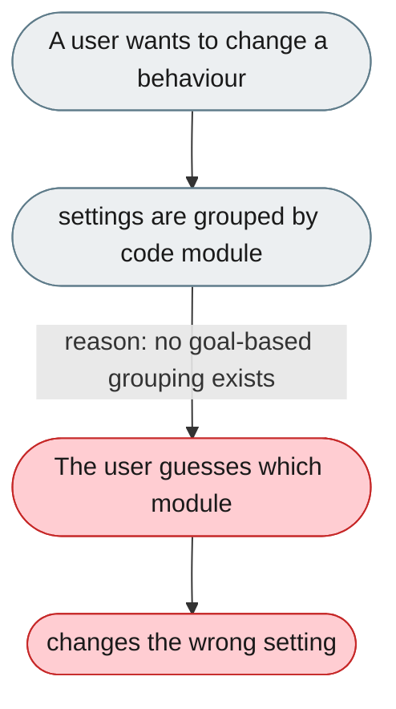
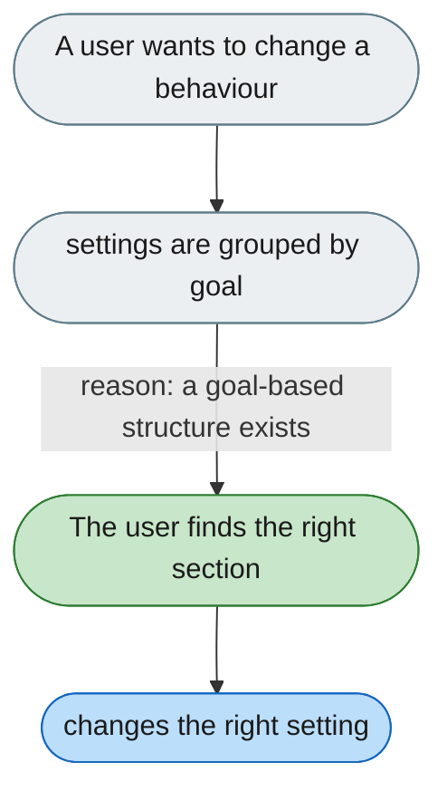

[← Index](../../../README.md) · jiuwenswarm Usability Review

---

# Settings are organized by code module, not by user task

*Concern: Navigation & Settings*

---

## The problem today

Settings modules (General, Models, Channels, Agent, Browser, Experimental) mirror the codebase, not the user's goals — e.g. "change the response language" could live under General, Models, or Agent.

---

## The proposed fix

Organize by goal: Getting started · Communication channels · Memory & context · Agent behavior · Advanced — so a task maps to one obvious place.

Concern: [Navigation & Settings](README.md).
