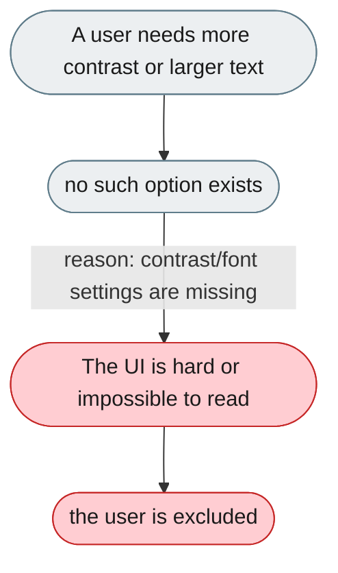
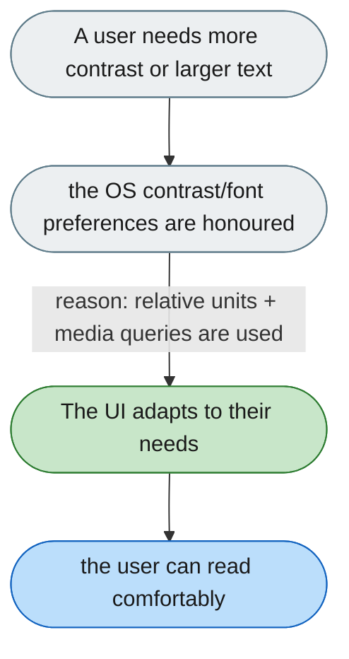

[← Index](../../../README.md) · jiuwenswarm Usability Review

---

# No high-contrast or large-text option

*Concern: Accessibility & Keyboard*

---

## The problem today

The UI has light/dark but no high-contrast theme, no font-size controls, and no zoom-safe layout testing.

---

## The proposed fix

Respect `prefers-contrast: more` and `prefers-reduced-motion`; use `rem` units so browser font-size preferences apply.

Concern: [Accessibility & Keyboard](README.md).
