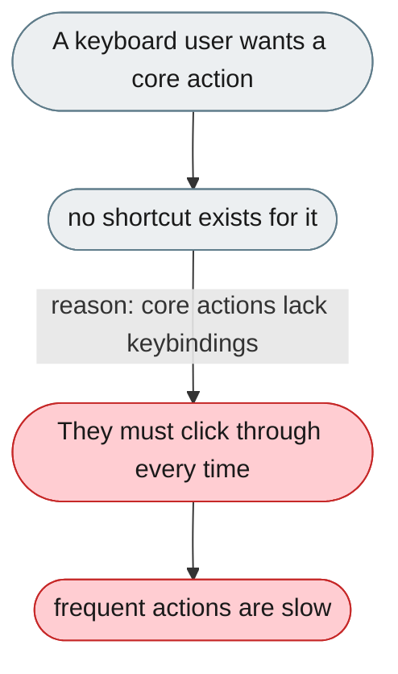
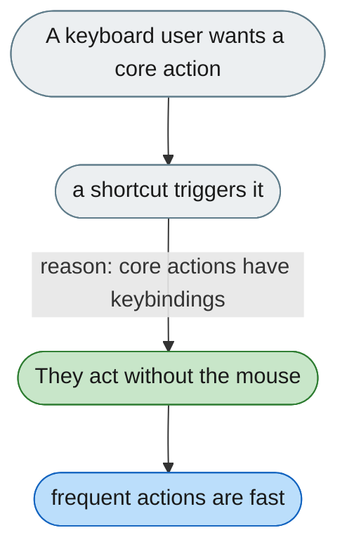

[← Index](../../../README.md) · jiuwenswarm Usability Review

---

# Core actions have no keyboard shortcuts

*Concern: Accessibility & Keyboard*

---

## The problem today

No documented shortcuts; only `Enter` submits. New conversation, stop, switch mode, open settings, and focus input have no keyboard access.

---

## The proposed fix

A keybinding layer: `Ctrl/Cmd+K` new conversation, `Escape` stop, `Ctrl/Cmd+/` palette, `Ctrl/Cmd+,` settings, arrow keys in the session list — and a `?` overlay.

Concern: [Accessibility & Keyboard](README.md).
