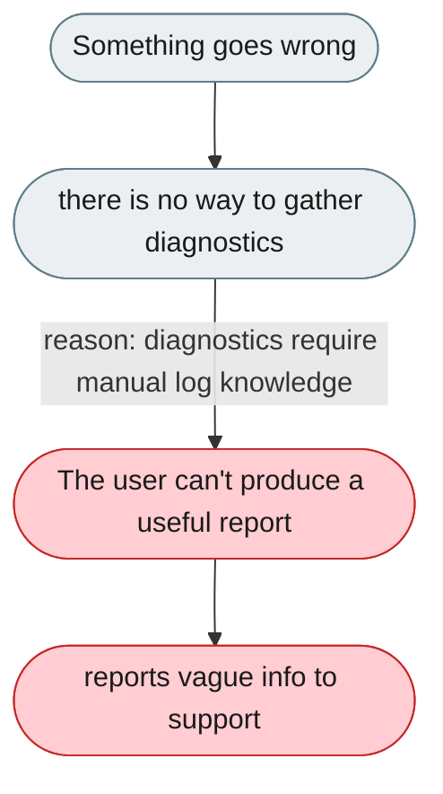
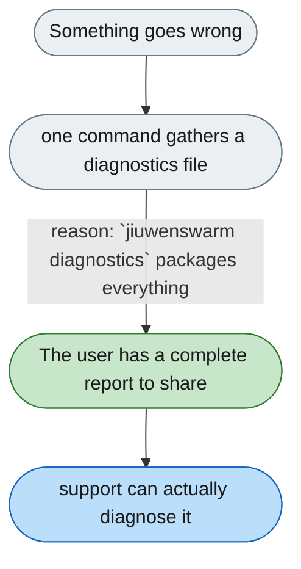

[← Index](../../../README.md) · jiuwenswarm Usability Review

---

# No single command to gather diagnostics for a bug report

*Concern: Diagnostics & Support*

---

## The problem today

When something goes wrong there is no tool to collect diagnostics; the user must know where logs live, which directory, and which log level to set.

---

## The proposed fix

A `jiuwenswarm diagnostics` command that collects the last 100 lines of each log, the config (keys redacted), and system info, writes `jiuwenswarm-diagnostics-YYYY-MM-DD.txt`, and says "Share this file when reporting an issue." Runnable remotely (SSH) and includes channel-specific logs.

Concern: [Diagnostics & Support](README.md).
