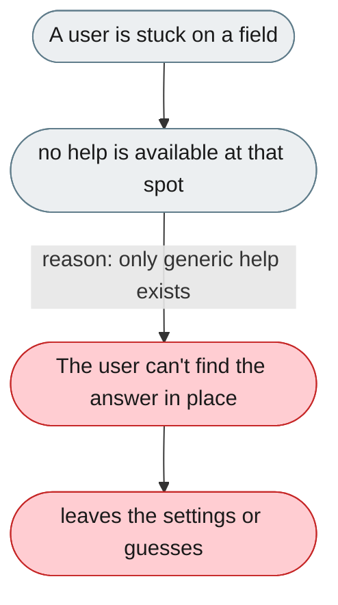
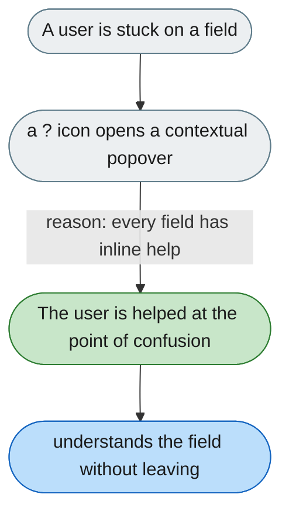

[← Index](../../../README.md) · jiuwenswarm Usability Review

---

# No help or tooltips at the point of confusion

*Concern: Diagnostics & Support*

---

## The problem today

Beyond a generic `HelpTips.tsx` and channel guide links there is no contextual help — no tooltips on complex fields, no "?" icons opening relevant docs.

---

## The proposed fix

Every non-obvious settings field gets a `?` icon opening a popover: what it does, where to find the value (e.g. the Feishu console), and a link to the full documentation.

Concern: [Diagnostics & Support](README.md).
