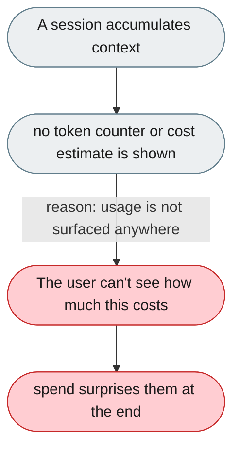
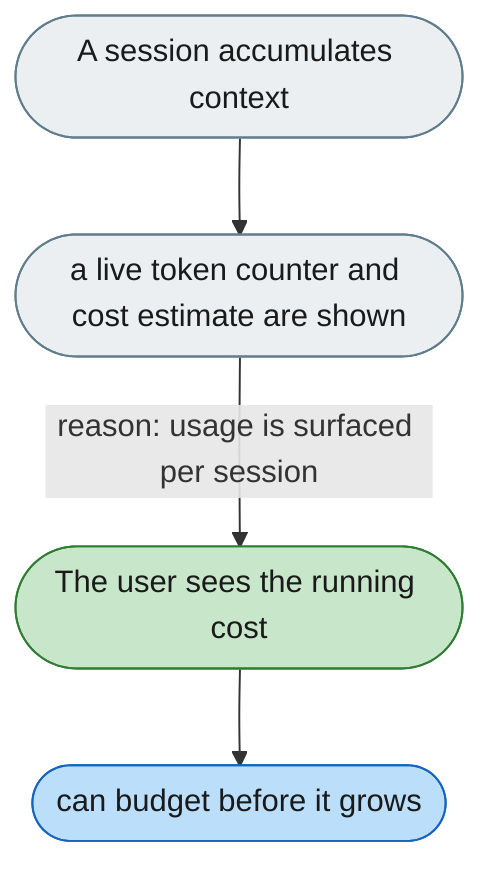

[← Index](../../../README.md) · jiuwenswarm Usability Review

---

# No visibility into token usage or session cost

*Concern: Cost & Token Economics*

---

## The problem today

Users have no visibility into how many tokens each conversation consumes. With large memory snapshots, many skills, long history, and subagents, context can exceed 30K tokens per call — with no counter, cost estimate, or warning.

---

## The proposed fix

A token counter in the chat panel (input + output), a per-message token annotation (collapsible), a cost estimate from per-model pricing, and an end-of-session card: "This session used 48,320 tokens (~$0.14)."

Concern: [Cost & Token Economics](README.md).
