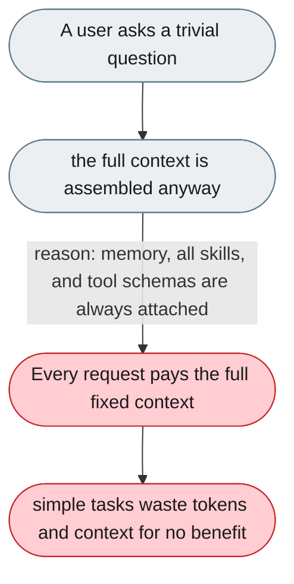
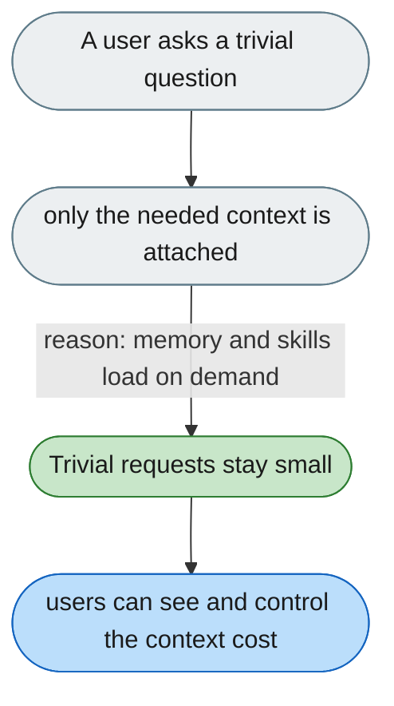

[← Index](../../../README.md) · jiuwenswarm Usability Review

---

# Trivial prompts still build the full context

*Concern: Cost & Token Economics*

---

## The problem today

Every request assembles the complete context regardless of how simple the prompt is: many static system sections (identity, strategy, output rules, code-mode rules, tone), plus dynamic sections rebuilt before every call (runtime environment, git status, memory, all installed skills) and the full tool schemas. A trivial query such as “how much is 2+2?” therefore carries the same large fixed context as a hard task — reaching tens of thousands of tokens when memory, skills, and tools are many — and the user cannot see it or control it.

---

## The proposed fix

Assemble context selectively: always keep a minimal core, but lazy-load memory and only attach the skills and tools a task plausibly needs, and show the user the token count per request so the overhead is visible and controllable.

Concern: [Cost & Token Economics](README.md).
