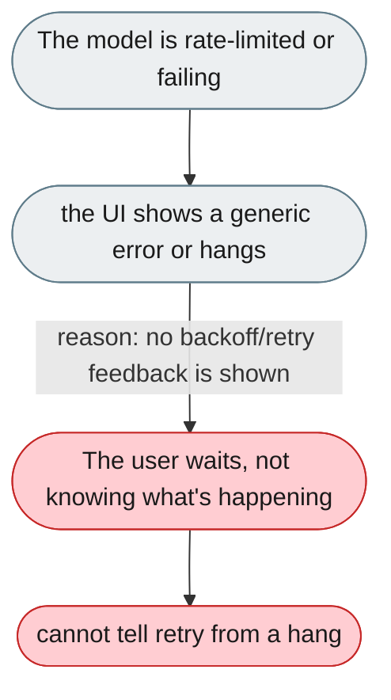
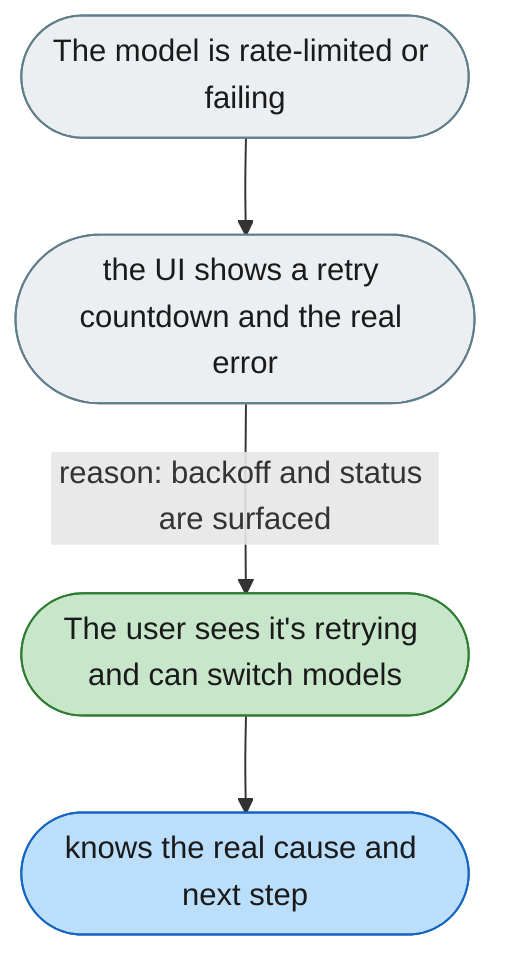

[← Index](../../../README.md) · jiuwenswarm Usability Review

---

# Rate limits and API failures hang or show nothing useful

*Concern: Health & Degradation*

---

## The problem today

When the model returns a 429/503 or an API rate limit is hit, the user sees a generic error or a silent hang — no backoff indicator, no "retrying in 15s", no suggestion to switch models.

---

## The proposed fix

Show a visible "Rate limited — retrying in 15s" countdown; after 3 consecutive errors, offer "The model is repeatedly failing — try deepseek-v3?" with one-click switch; include the HTTP status and the model's verbatim error; log provider failures at WARNING for monitors.

Concern: [Health & Degradation](README.md).
