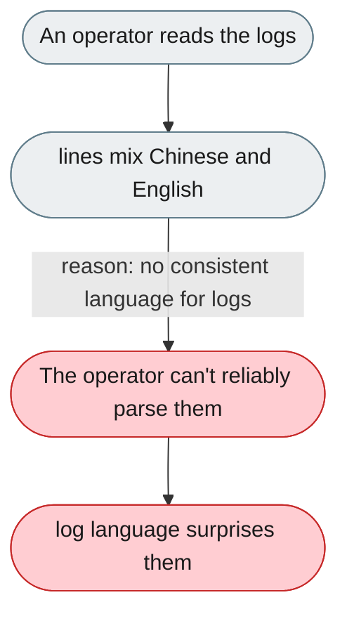
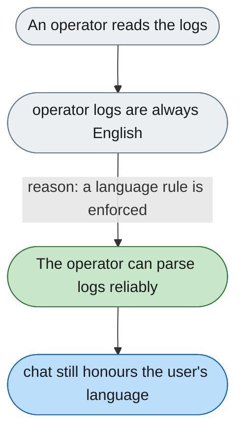

[← Index](../../../README.md) · jiuwenswarm Usability Review

---

# Logs and config mix languages unpredictably

*Concern: Running & Managing the Instance*

---

## The problem today

Error messages, log strings, and config comments mix Chinese and English unpredictably, so an operator reading logs can't predict the language.

---

## The proposed fix

All operator-facing logs (WARNING+), CLI output, and errors are English unconditionally; user-facing chat respects `preferred_response_language`; config comments are provided as `config.zh.yaml` / `config.en.yaml` templates.

Concern: [Running & Managing the Instance](README.md).
