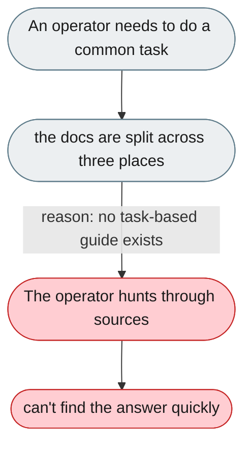
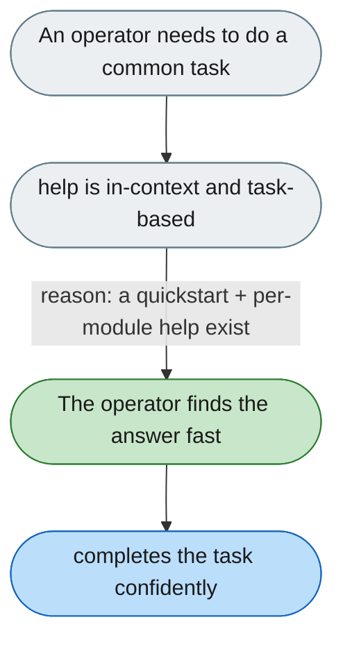

[← Index](../../../README.md) · jiuwenswarm Usability Review

---

# Documentation is scattered with no guide for common tasks

*Concern: Running & Managing the Instance*

---

## The problem today

Docs live in inline YAML comments, `/docs/` Markdown, and skill `SKILL.md` files, with no centralized guide for the three most common tasks: add a channel, debug a task, create a skill.

---

## The proposed fix

An integrated help panel in settings (each module with a collapsible "Help"), a single `quickstart.md` covering install → configure → start → first task → channel → skill, and doc links referenced from complex config sections.

Concern: [Running & Managing the Instance](README.md).
