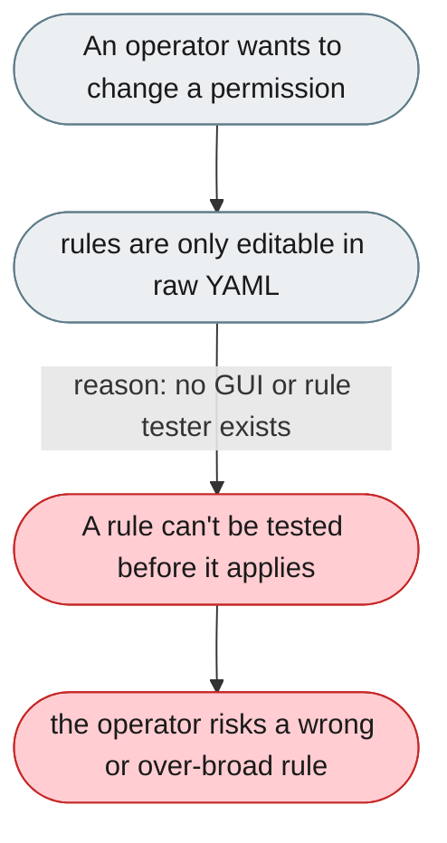
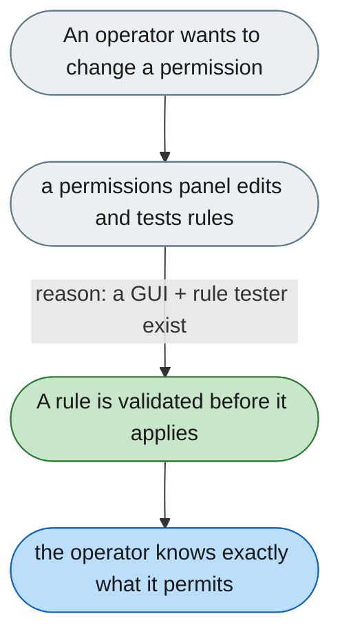

[← Index](../../../README.md) · jiuwenswarm Usability Review

---

# Permission rules can only be edited in raw YAML

*Concern: Running & Managing the Instance*

---

## The problem today

The tiered permission policy uses a complex regex rule syntax with no Web UI to create, edit, or test rules; the warning dialog only shows a generic "full access" message.

---

## The proposed fix

A permissions panel listing active rules (tool pattern, allowed/denied, who it applies to), an inline editor with regex validation, a "Test" field to see which rule a tool matches, and a plain-language "What can the agent do?" summary.

Concern: [Running & Managing the Instance](README.md).
