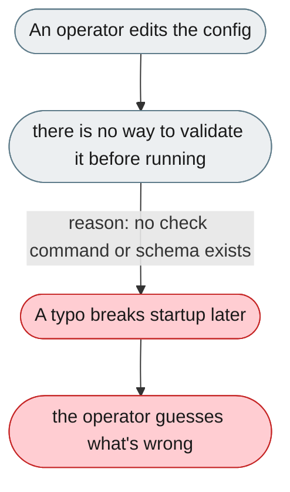

[← Index](../../../README.md) · jiuwenswarm Usability Review

---

# The config file has no validation or check tool

*Concern: Startup & Configuration*

---

## The problem today

`config.yaml` bundles models, memory, channels, permissions, observability, SSH, agents and traces in one file, with no tool to check an edited copy before running. Env substitution uses undocumented `${VAR:-default}` syntax; crypto failures fall back silently.



---

## The proposed fix

A `jiuwenswarm config check` command that validates the file against a JSON Schema and prints each error with a line number and fix; a `jiuwenswarm_config_version` field; env-substitution failures logged at WARNING; and Web UI settings as the primary interface for operators who avoid YAML.

```mermaid
flowchart TD
    classDef fail  fill:#FFCDD2,color:#1a1a1a,stroke:#C62828
    classDef ok    fill:#BBDEFB,color:#1a1a1a,stroke:#1565C0
    classDef fix   fill:#C8E6C9,color:#1a1a1a,stroke:#2E7D32
    classDef plain fill:#ECEFF1,color:#1a1a1a,stroke:#607D8B
    START(["An operator edits the config"]):::plain
    MID(["`config check` validates it against a schema"]):::plain
    START --> MID
    MID -->|"reason: errors cite the line and fix"| OUT(["Problems are caught before running"]):::fix
    OUT --> DONE(["the operator fixes them immediately"]):::ok
```

Concern: [Startup & Configuration](README.md).
