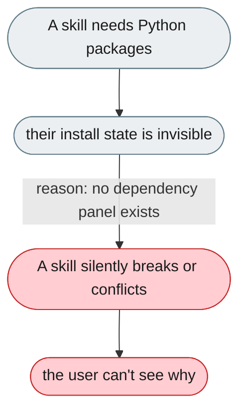
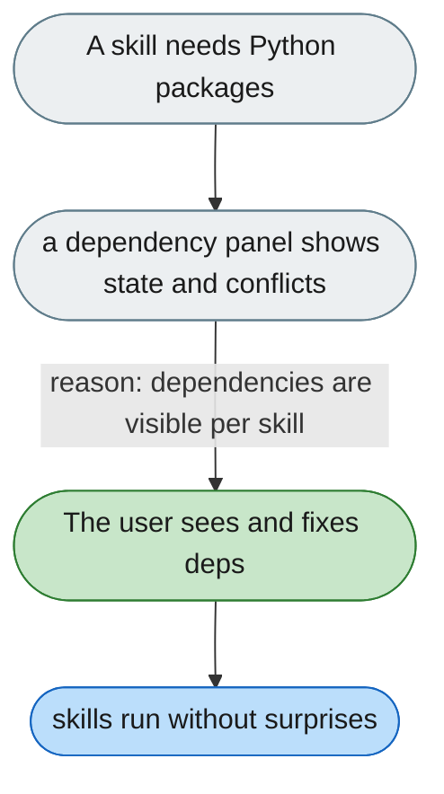

[← Index](../../../README.md) · jiuwenswarm Usability Review

---

# Skill Python dependencies and conflicts are invisible

*Concern: Skill Authoring & Dependencies*

---

## The problem today

Skills may have a `requirements.txt`, installed at load time, but there's no UI showing which skills have deps, whether they're installed, or whether two conflict.

---

## The proposed fix

A per-skill dependency panel: required packages, installed status, version conflicts; an "Install dependencies" button that runs in the background with progress.

Concern: [Skill Authoring & Dependencies](README.md).
