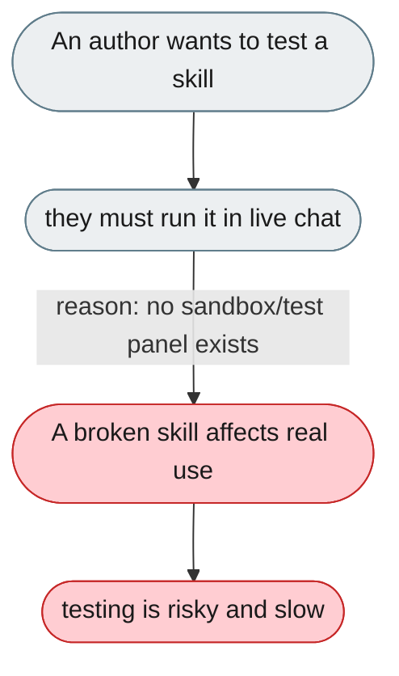
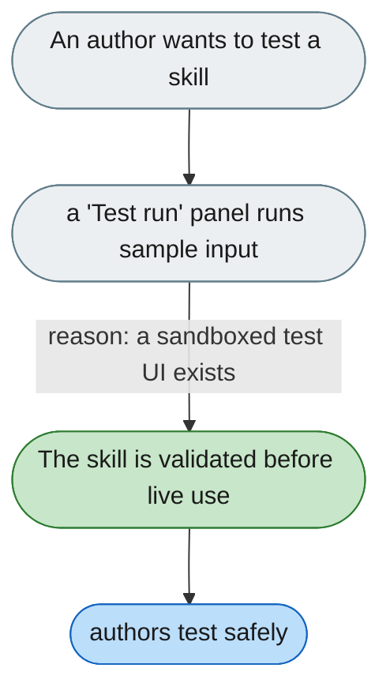

[← Index](../../../README.md) · jiuwenswarm Usability Review

---

# Skills can only be tested through a live chat

*Concern: Skill Authoring & Dependencies*

---

## The problem today

There's no way to test a skill with sample input from the UI before live use — it must be triggered through a real chat session.

---

## The proposed fix

A "Test run" panel in the skill view: paste sample input, run, see output — the skill's unit test. Trajectory already captures the data; wiring a test UI is achievable.

Concern: [Skill Authoring & Dependencies](README.md).
