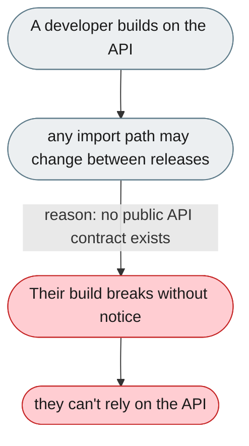
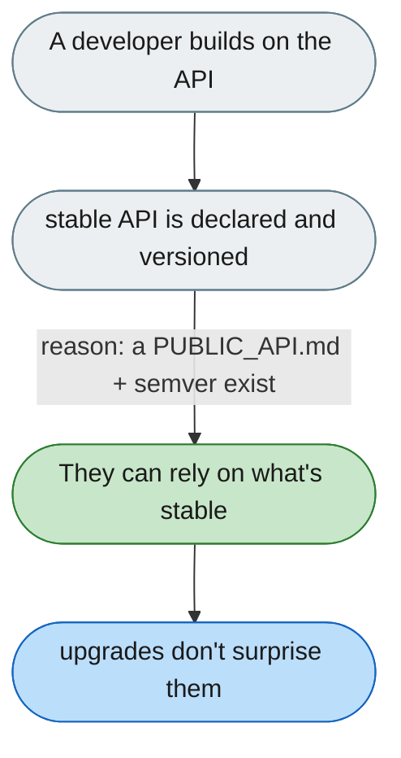

---

# No stable public API or semantic-versioning contract

*Concern: Extension Documentation & Stability*

---

## The problem today

Both packages are `0.x` and `agent-core` is imported from a git SHA — any import path can change without notice, so developers can't build with confidence.

---

## The proposed fix

A `PUBLIC_API.md`, a breaking-change changelog, `@public`/`@internal` markers, and proper semver once stable.

